# v1.2.1 项目的事件和函数关系流程表

> 版本：`v1.2.1`
> 平台版本：`ESP-IDF 5.5.3`
> 主题：统一事件结构 + 程序函数调用关系

---

# 1. 这份文档怎么看

这份文档按“先总体、后分模块”的方式整理，建议按下面顺序看：

1. 先看统一事件结构  
2. 再看总体调用链  
3. 再看时序图  
4. 最后看分模块函数关系图

这样最适合快速建立整体理解。

---

# 2. 本版核心变化

`v1.2.1` 的重点不是换任务结构，也不是加新外设，而是把：

```text
按键专用消息
```

升级成：

```text
统一事件消息
```

也就是把：

```text
button_service
-> app_button_msg_t
-> Queue
-> app_event_task
```

升级成：

```text
button_service
-> app_event_msg_t
-> Queue
-> app_event_task
```

---

# 3. 统一事件结构总览图

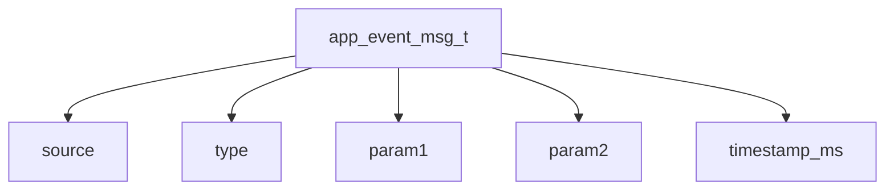

可以这样理解：

- `source`
  - 事件来自哪个模块
- `type`
  - 事件属于什么类别
- `param1`
  - 主参数
- `param2`
  - 次参数
- `timestamp_ms`
  - 事件时间戳

---

# 4. 按键事件映射关系图

当前 `v1.2.1` 虽然还是按键事件，但已经按统一事件格式封装：

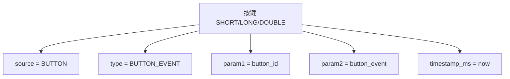

这意味着：

- 现在只服务按键
- 但结构已经为后续更多模块预留好了入口

---

# 5. 程序总体调用关系图

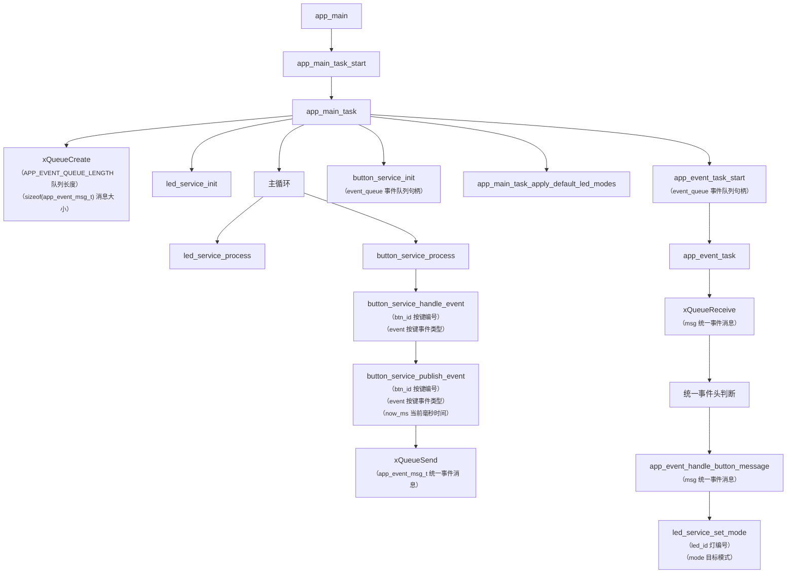

---

# 6. 统一事件处理流程图

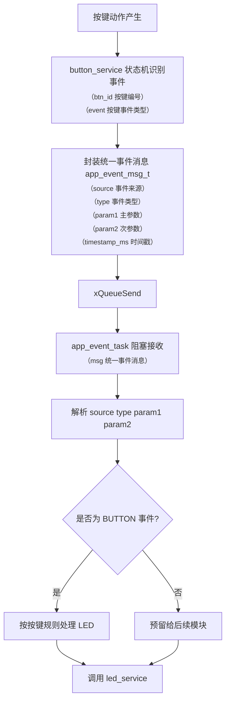

---

# 7. 主循环与任务关系图

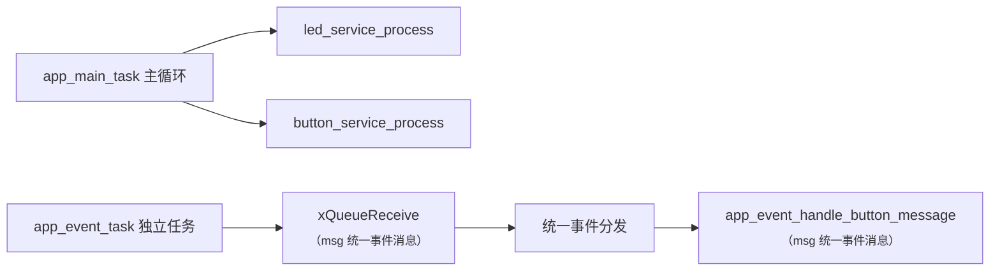

这个图最值得注意的点是：

- `app_main_task`
  - 负责周期性服务
- `app_event_task`
  - 负责阻塞式等待队列消息

---

# 8. 单击时序图

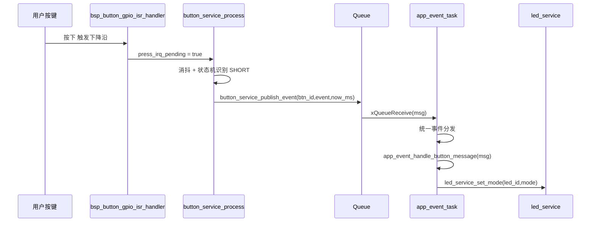

---

# 9. 日志与统计关系图

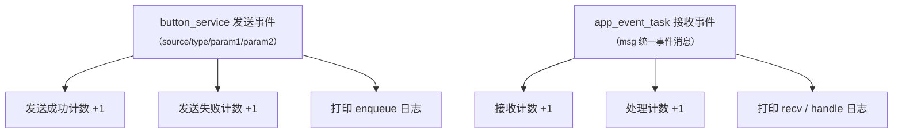

这部分的意义是：

- 不是只有功能逻辑才重要
- 可观察性本身也是架构的一部分

---

# 10. 分模块函数关系图

从这一节开始，看单个模块内部函数怎么配合。

---

## 10.1 `button_service.c` 模块函数关系图

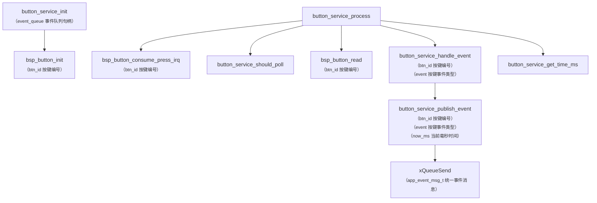

这个模块的关键层次是：

- 输入采样
- 状态判断
- 事件输出

---

## 10.2 `button_service.c` 状态判断细化图

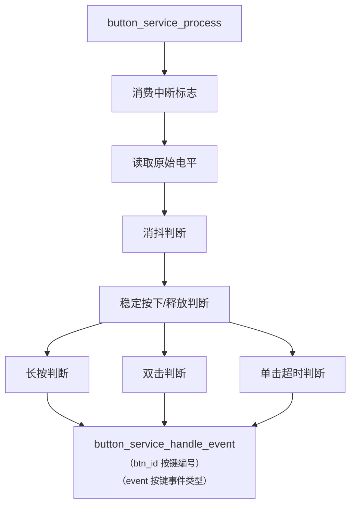

---

## 10.3 `app_event_task.c` 模块函数关系图

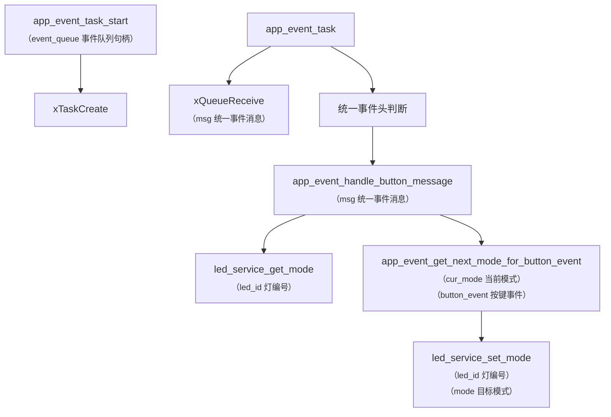

这个模块的重点是：

- 先收消息
- 再按统一事件头分类
- 最后进入具体业务函数

---

## 10.4 `app_main_task.c` 模块函数关系图

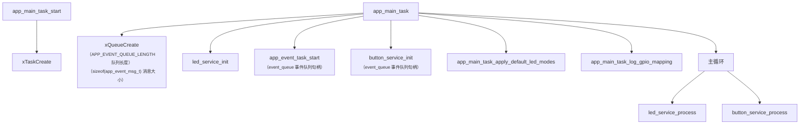

这个模块负责：

- 系统编排
- 初始化顺序控制
- 主循环调度

---

## 10.5 `led_service.c` 模块函数关系图

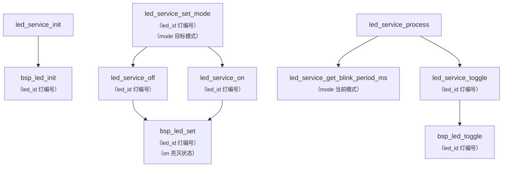

`led_service` 的关键特点是：

- 模式管理和硬件控制分开
- `set_mode()` 负责决定模式
- `process()` 负责周期性执行闪烁

---

## 10.6 `bsp_button.c` 模块函数关系图

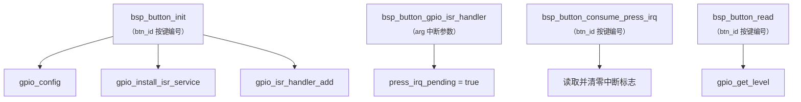

这个模块非常适合当“底层模板”来看：

- 初始化硬件
- 响应中断
- 提供读取接口

---

# 11. 分模块阅读建议

后面你阅读代码时，建议按下面顺序理解：

1. 先看统一事件结构总览  
2. 再看总体调用关系图  
3. 再看 `app_main_task.c`  
4. 再看 `button_service.c`  
5. 再看 `app_event_task.c`  
6. 最后看 `led_service.c` 和 `bsp_button.c`

这个顺序最符合程序真实运行路径。

---

# 12. 一句话总结

```text
v1.2.1 最值得学的，不只是统一事件结构本身，
而是它如何把“识别、传递、分发、执行”这四层函数关系真正串起来。
```
