# v1.3.0 项目的事件和函数关系流程表

> 版本：`v1.3.0`
> 平台版本：`ESP-IDF 5.5.3`
> 主题：`I2C + XL9555` 驱动基础与项目接入关系

---

# 1. 这份文档怎么看

这份文档按“先总体、后分模块”的方式整理，建议按下面顺序看：

1. 先看板级硬件关系
2. 再看总体事件链
3. 再看初始化流程
4. 再看关键时序图
5. 最后看分模块函数关系图

这样最适合快速建立 `v1.3.0` 的整体理解。

---

# 2. 本版核心变化

`v1.3.0` 的重点，不只是新增一个芯片驱动，而是把：

```text
ESP32 直连 GPIO 输入
```

逐步升级成：

```text
ESP32 I2C
-> driver
-> 板级 BSP
-> button_service
-> unified event queue
-> app_event_task
```

也就是说，这版的真正重点是：

- 把 `I2C` 访问能力建立起来
- 把 `XL9555` 做成可复用模板
- 把板载按键和板载控制资源接到现有项目架构里

---

# 3. 板级硬件关系总览图

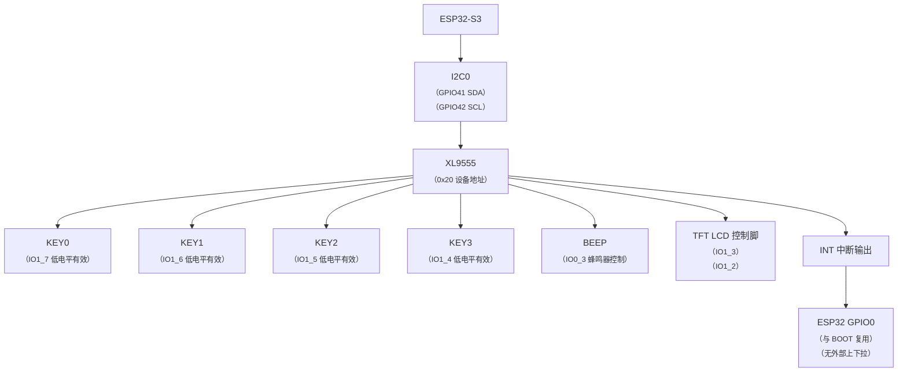

---

# 4. 总体事件与驱动关系图

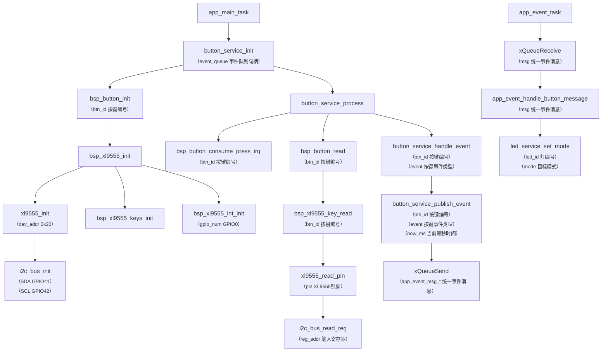

---

# 5. 初始化流程图

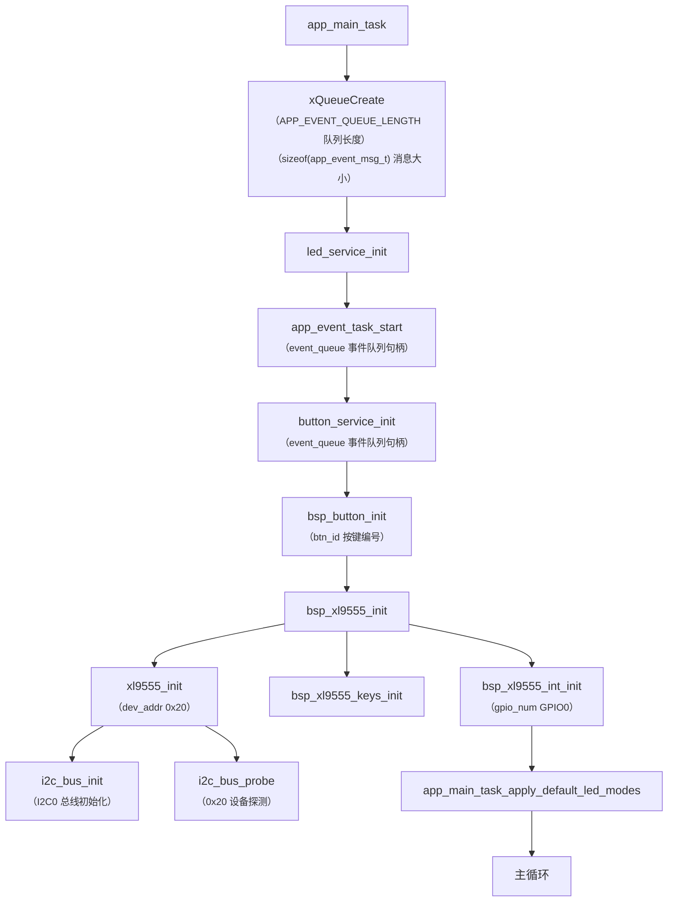

这个流程最值得你记住的是：

- 先有 `I2C`
- 再有 `XL9555`
- 再有板级 `BSP`
- 最后才让上层服务去使用

---

# 6. 板载按键输入链流程图

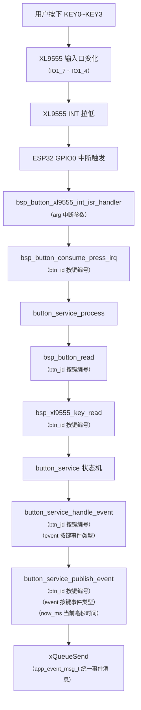

---

# 7. 蜂鸣器与 LCD 控制接口关系图

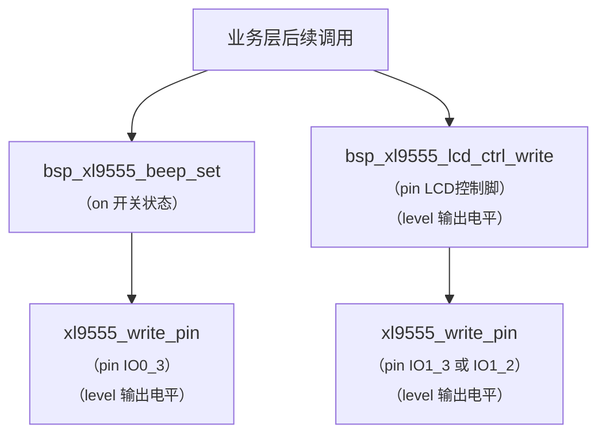

这个图的意义是：

- 这版即使还没正式做 LCD
- 也要先把控制链的接口层次设计好

---

# 8. 关键时序图

## 8.1 板载按键事件时序图

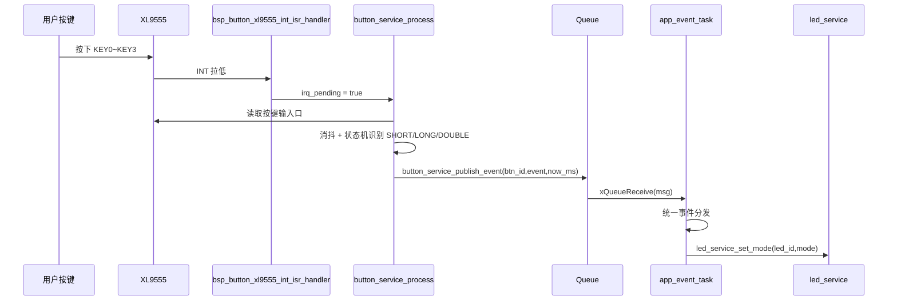

## 8.2 XL9555 设备初始化时序图

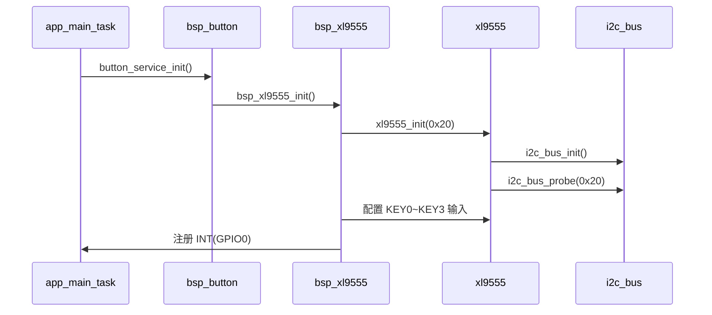

---

# 9. 分模块函数关系图

先看 `driver`，再看 `bsp`，会更符合现在的工程结构。

---

## 9.1 `driver/i2c_bus.c` 模块函数关系图

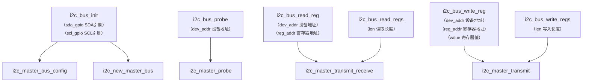

这个模块是后续多个 `I2C` 外设的公共模板基础。

---

## 9.2 `driver/xl9555.c` 模块函数关系图

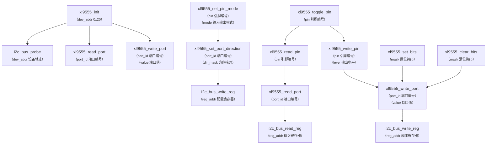

这个模块的重点是：

- 既要服务当前项目
- 也要沉淀成后续可复用模板

---

## 9.3 `bsp/bsp_xl9555.c` 模块函数关系图

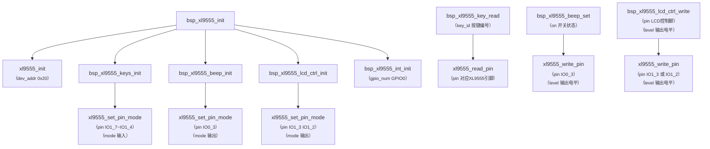

这个模块的作用是把：

- 通用 `XL9555` 驱动
- 当前板子的实际连接关系

明确分开。

---

## 9.4 `bsp/bsp_button.c` 模块函数关系图

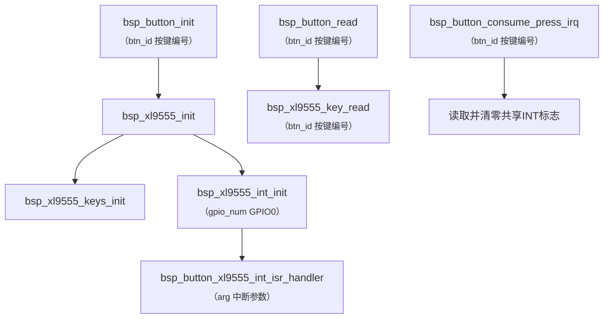

这个模块现在的重点是：

- 对上保持原有 `button` 接口不变
- 对下切到 `XL9555` 共享中断输入

---

## 9.5 `button_service.c` 模块函数关系图

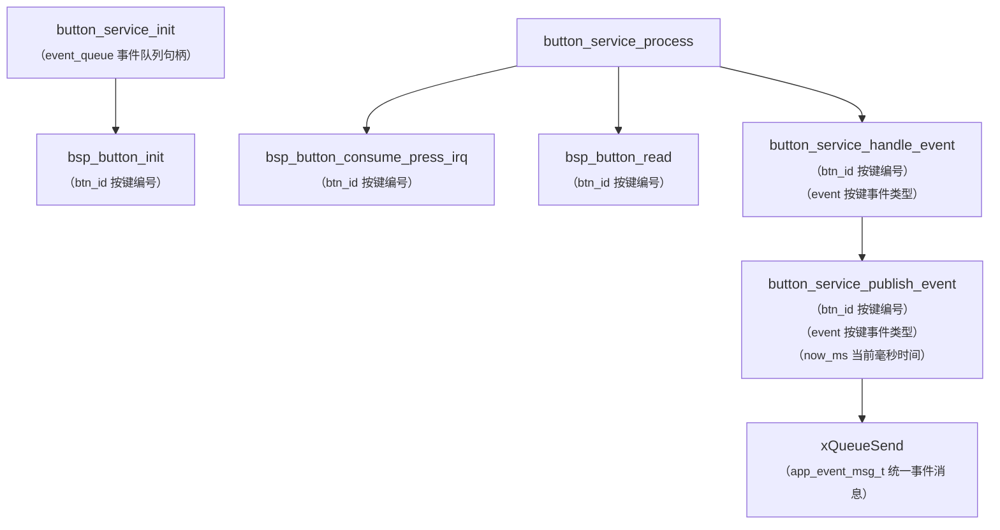

这里最重要的是：

- 状态机逻辑尽量继续复用
- 只替换底层输入来源

---

## 9.6 `app_event_task.c` 模块函数关系图

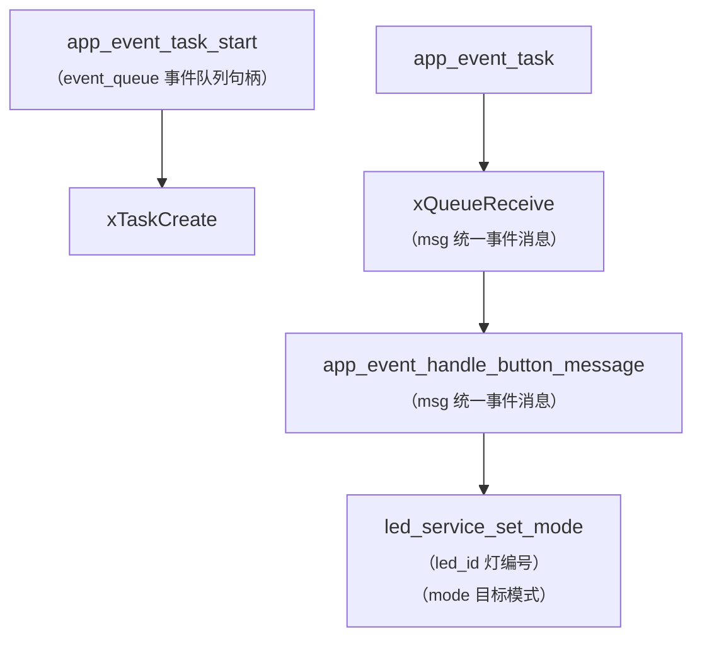

这版里它的结构不会大变，主要还是继续接收统一事件并处理业务。

---

# 10. 分模块阅读建议

后面你阅读代码时，建议按下面顺序理解：

1. 先看板级硬件关系图
2. 再看总体事件与驱动关系图
3. 再看 `components/driver/i2c_bus.c`
4. 再看 `components/driver/xl9555.c`
5. 再看 `components/bsp/bsp_xl9555.c`
6. 再看 `components/bsp/bsp_button.c`
7. 再看 `components/services/button_service.c`
8. 最后看 `components/app/app_event_task.c`

这个顺序最符合 `v1.3.0` 的真实设计意图。

---

# 11. 一句话总结

```text
v1.3.0 最值得学的，不只是 XL9555 本身，
而是怎样把“driver、bsp、service、app”这四层关系真正拆开。
```
