# v1.3.1 项目的事件和函数关系流程表

## 1. 版本定位

`v1.3.1` 在 `v1.3.0` 的基础上，继续完善 `XL9555` 板载交互能力。  
这一版的重点是：

- `KEY0 ~ KEY3` 四键完整接入
- 新增 `BEEP` 输出反馈
- 保持统一事件结构与任务通信主链不变
- 新增功能键与蜂鸣器测试模式

## 2. 项目总流程图

这一张图从 `main` 入口开始，把初始化链、主循环链和事件任务链都串起来。

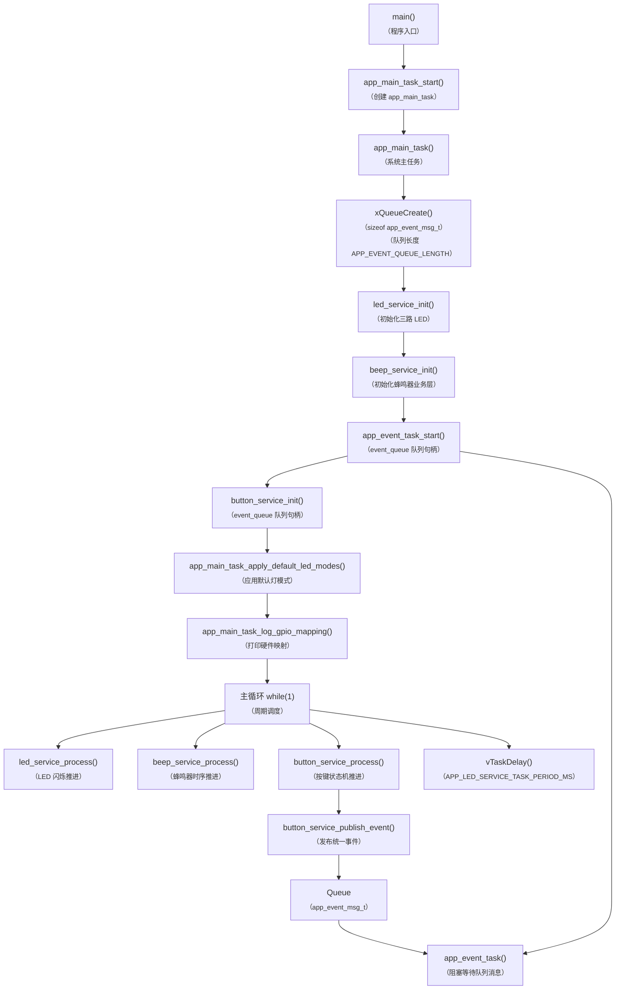
```mermaid
flowchart TD
    A["main()<br/><sub>（程序入口）</sub>"] --> B["app_main_task_start()<br/><sub>（创建 app_main_task）</sub>"]
    B --> C["app_main_task()<br/><sub>（系统主任务）</sub>"]
    C --> D["xQueueCreate()<br/><sub>（sizeof app_event_msg_t）<br/>（队列长度 APP_EVENT_QUEUE_LENGTH）</sub>"]
    D --> E["led_service_init()<br/><sub>（初始化三路 LED）</sub>"]
    E --> F["beep_service_init()<br/><sub>（初始化蜂鸣器业务层）</sub>"]
    F --> G["app_event_task_start()<br/><sub>（event_queue 队列句柄）</sub>"]
    G --> H["button_service_init()<br/><sub>（event_queue 队列句柄）</sub>"]
    H --> I["app_main_task_apply_default_led_modes()<br/><sub>（应用默认灯模式）</sub>"]
    I --> J["app_main_task_log_gpio_mapping()<br/><sub>（打印硬件映射）</sub>"]
    J --> K["主循环 while(1)<br/><sub>（周期调度）</sub>"]
    K --> L["led_service_process()<br/><sub>（LED 闪烁推进）</sub>"]
    K --> M["beep_service_process()<br/><sub>（蜂鸣器时序推进）</sub>"]
    K --> N["button_service_process()<br/><sub>（按键状态机推进）</sub>"]
    K --> O["vTaskDelay()<br/><sub>（APP_LED_SERVICE_TASK_PERIOD_MS）</sub>"]

    G --> P["app_event_task()<br/><sub>（阻塞等待队列消息）</sub>"]
    N --> Q["button_service_publish_event()<br/><sub>（发布统一事件）</sub>"]
    Q --> R["Queue<br/><sub>（app_event_msg_t）</sub>"]
    R --> P
```

## 3. 主循环时序推进图

这一块很值得单独看，因为 `v1.3.1` 不是纯任务化堆功能，而是“主循环推进状态机 + 事件任务做业务分发”的混合结构。

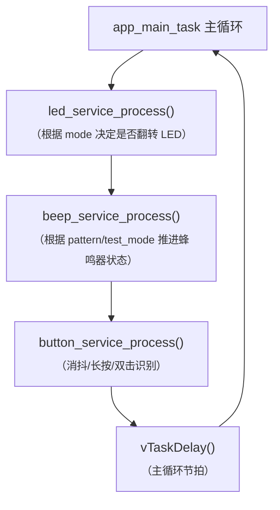
```mermaid
flowchart TD
    A["app_main_task 主循环"] --> B["led_service_process()<br/><sub>（根据 mode 决定是否翻转 LED）</sub>"]
    B --> C["beep_service_process()<br/><sub>（根据 pattern/test_mode 推进蜂鸣器状态）</sub>"]
    C --> D["button_service_process()<br/><sub>（消抖/长按/双击识别）</sub>"]
    D --> E["vTaskDelay()<br/><sub>（主循环节拍）</sub>"]
    E --> A
```

## 4. 统一事件消息结构与参数传递

### 4.1 消息结构理解

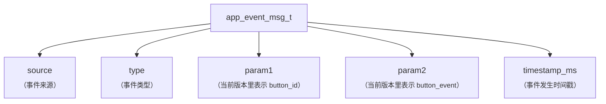
```mermaid
flowchart TD
    A["app_event_msg_t"] --> B["source<br/><sub>（事件来源）</sub>"]
    A --> C["type<br/><sub>（事件类型）</sub>"]
    A --> D["param1<br/><sub>（当前版本里表示 button_id）</sub>"]
    A --> E["param2<br/><sub>（当前版本里表示 button_event）</sub>"]
    A --> F["timestamp_ms<br/><sub>（事件发生时间戳）</sub>"]
```

### 4.2 函数之间的关键参数传递图

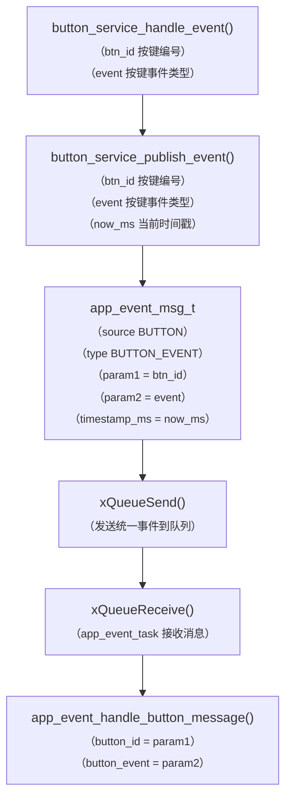
```mermaid
flowchart TD
    A["button_service_handle_event()<br/><sub>（btn_id 按键编号）<br/>（event 按键事件类型）</sub>"] --> B["button_service_publish_event()<br/><sub>（btn_id 按键编号）<br/>（event 按键事件类型）<br/>（now_ms 当前时间戳）</sub>"]
    B --> C["app_event_msg_t<br/><sub>（source BUTTON）<br/>（type BUTTON_EVENT）<br/>（param1 = btn_id）<br/>（param2 = event）<br/>（timestamp_ms = now_ms）</sub>"]
    C --> D["xQueueSend()<br/><sub>（发送统一事件到队列）</sub>"]
    D --> E["xQueueReceive()<br/><sub>（app_event_task 接收消息）</sub>"]
    E --> F["app_event_handle_button_message()<br/><sub>（button_id = param1）<br/>（button_event = param2）</sub>"]
```

### 4.3 业务键参数解释图

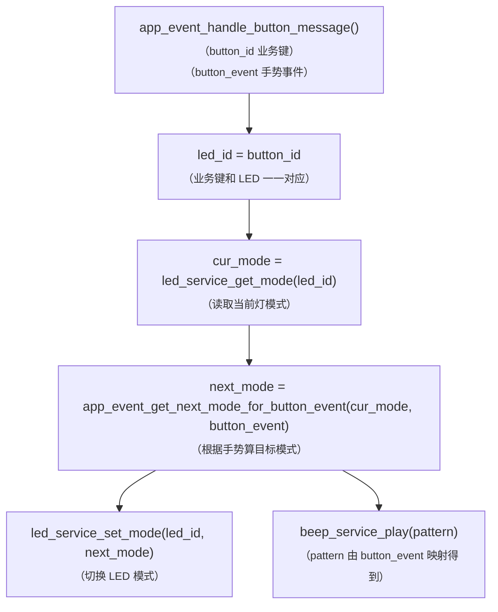
```mermaid
flowchart TD
    A["app_event_handle_button_message()<br/><sub>（button_id 业务键）<br/>（button_event 手势事件）</sub>"] --> B["led_id = button_id<br/><sub>（业务键和 LED 一一对应）</sub>"]
    B --> C["cur_mode = led_service_get_mode(led_id)<br/><sub>（读取当前灯模式）</sub>"]
    C --> D["next_mode = app_event_get_next_mode_for_button_event(cur_mode, button_event)<br/><sub>（根据手势算目标模式）</sub>"]
    D --> E["led_service_set_mode(led_id, next_mode)<br/><sub>（切换 LED 模式）</sub>"]
    D --> F["beep_service_play(pattern)<br/><sub>（pattern 由 button_event 映射得到）</sub>"]
```

### 4.4 功能键参数解释图

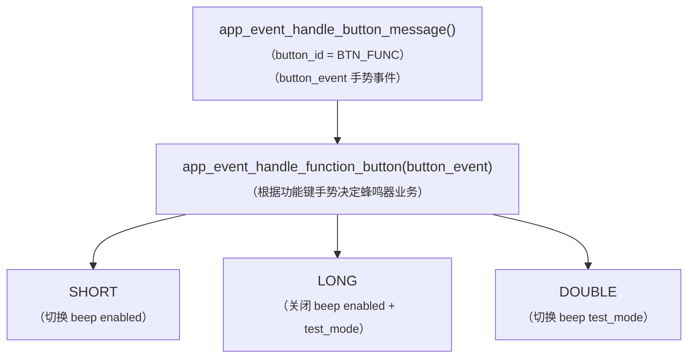
```mermaid
flowchart TD
    A["app_event_handle_button_message()<br/><sub>（button_id = BTN_FUNC）<br/>（button_event 手势事件）</sub>"] --> B["app_event_handle_function_button(button_event)<br/><sub>（根据功能键手势决定蜂鸣器业务）</sub>"]
    B --> C["SHORT<br/><sub>（切换 beep enabled）</sub>"]
    B --> D["LONG<br/><sub>（关闭 beep enabled + test_mode）</sub>"]
    B --> E["DOUBLE<br/><sub>（切换 beep test_mode）</sub>"]
```

## 5. 按键总流程图

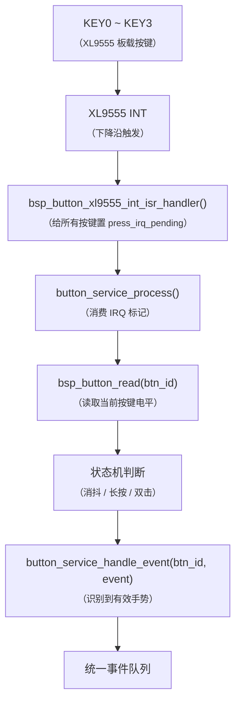
```mermaid
flowchart TD
    A["KEY0 ~ KEY3<br/><sub>（XL9555 板载按键）</sub>"] --> B["XL9555 INT<br/><sub>（下降沿触发）</sub>"]
    B --> C["bsp_button_xl9555_int_isr_handler()<br/><sub>（给所有按键置 press_irq_pending）</sub>"]
    C --> D["button_service_process()<br/><sub>（消费 IRQ 标记）</sub>"]
    D --> E["bsp_button_read(btn_id)<br/><sub>（读取当前按键电平）</sub>"]
    E --> F["状态机判断<br/><sub>（消抖 / 长按 / 双击）</sub>"]
    F --> G["button_service_handle_event(btn_id, event)<br/><sub>（识别到有效手势）</sub>"]
    G --> H["统一事件队列"]
```

## 6. KEY0 ~ KEY2 业务键流程图

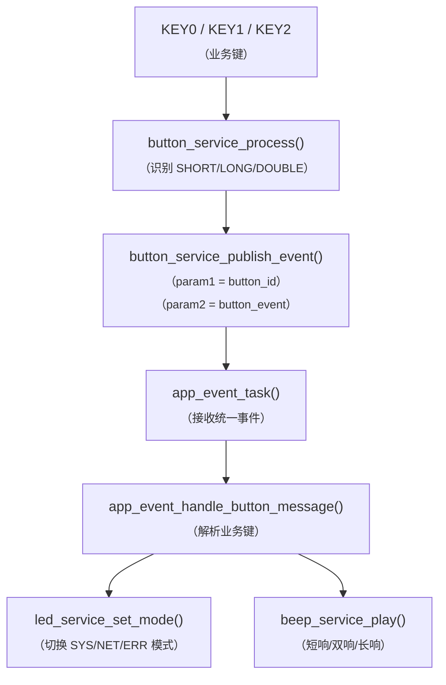
```mermaid
flowchart TD
    A["KEY0 / KEY1 / KEY2<br/><sub>（业务键）</sub>"] --> B["button_service_process()<br/><sub>（识别 SHORT/LONG/DOUBLE）</sub>"]
    B --> C["button_service_publish_event()<br/><sub>（param1 = button_id）<br/>（param2 = button_event）</sub>"]
    C --> D["app_event_task()<br/><sub>（接收统一事件）</sub>"]
    D --> E["app_event_handle_button_message()<br/><sub>（解析业务键）</sub>"]
    E --> F["led_service_set_mode()<br/><sub>（切换 SYS/NET/ERR 模式）</sub>"]
    E --> G["beep_service_play()<br/><sub>（短响/双响/长响）</sub>"]
```

## 7. KEY3 功能键流程图

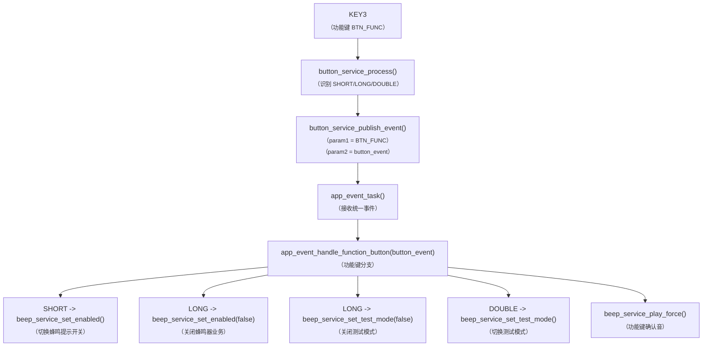
```mermaid
flowchart TD
    A["KEY3<br/><sub>（功能键 BTN_FUNC）</sub>"] --> B["button_service_process()<br/><sub>（识别 SHORT/LONG/DOUBLE）</sub>"]
    B --> C["button_service_publish_event()<br/><sub>（param1 = BTN_FUNC）<br/>（param2 = button_event）</sub>"]
    C --> D["app_event_task()<br/><sub>（接收统一事件）</sub>"]
    D --> E["app_event_handle_function_button(button_event)<br/><sub>（功能键分支）</sub>"]
    E --> F["SHORT -> beep_service_set_enabled()<br/><sub>（切换蜂鸣提示开关）</sub>"]
    E --> G["LONG -> beep_service_set_enabled(false)<br/><sub>（关闭蜂鸣器业务）</sub>"]
    E --> H["LONG -> beep_service_set_test_mode(false)<br/><sub>（关闭测试模式）</sub>"]
    E --> I["DOUBLE -> beep_service_set_test_mode()<br/><sub>（切换测试模式）</sub>"]
    E --> J["beep_service_play_force()<br/><sub>（功能键确认音）</sub>"]
```

## 8. BEEP 蜂鸣器完整流程图

这一块是你特别提到要补的。这里分成“初始化链”和“运行链”两张图。

### 8.1 BEEP 初始化流程图

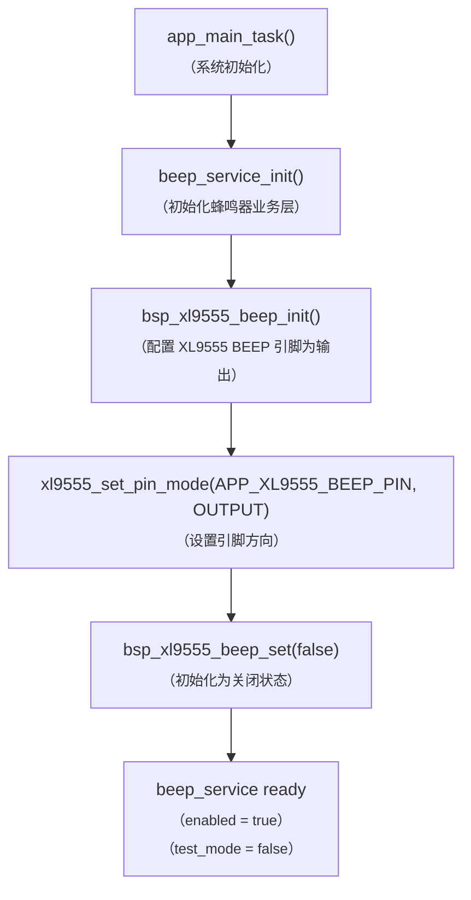
```mermaid
flowchart TD
    A["app_main_task()<br/><sub>（系统初始化）</sub>"] --> B["beep_service_init()<br/><sub>（初始化蜂鸣器业务层）</sub>"]
    B --> C["bsp_xl9555_beep_init()<br/><sub>（配置 XL9555 BEEP 引脚为输出）</sub>"]
    C --> D["xl9555_set_pin_mode(APP_XL9555_BEEP_PIN, OUTPUT)<br/><sub>（设置引脚方向）</sub>"]
    D --> E["bsp_xl9555_beep_set(false)<br/><sub>（初始化为关闭状态）</sub>"]
    E --> F["beep_service ready<br/><sub>（enabled = true）<br/>（test_mode = false）</sub>"]
```

### 8.2 BEEP 运行与识别处理流程图

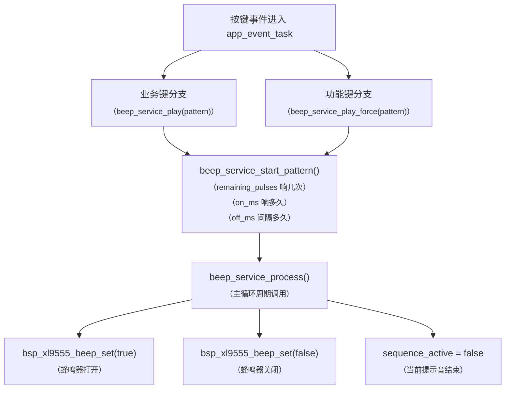
```mermaid
flowchart TD
    A["按键事件进入 app_event_task"] --> B["业务键分支<br/><sub>（beep_service_play(pattern)）</sub>"]
    A --> C["功能键分支<br/><sub>（beep_service_play_force(pattern)）</sub>"]
    B --> D["beep_service_start_pattern()<br/><sub>（remaining_pulses 响几次）<br/>（on_ms 响多久）<br/>（off_ms 间隔多久）</sub>"]
    C --> D
    D --> E["beep_service_process()<br/><sub>（主循环周期调用）</sub>"]
    E --> F["bsp_xl9555_beep_set(true)<br/><sub>（蜂鸣器打开）</sub>"]
    E --> G["bsp_xl9555_beep_set(false)<br/><sub>（蜂鸣器关闭）</sub>"]
    E --> H["sequence_active = false<br/><sub>（当前提示音结束）</sub>"]
```

### 8.3 BEEP 测试模式流程图

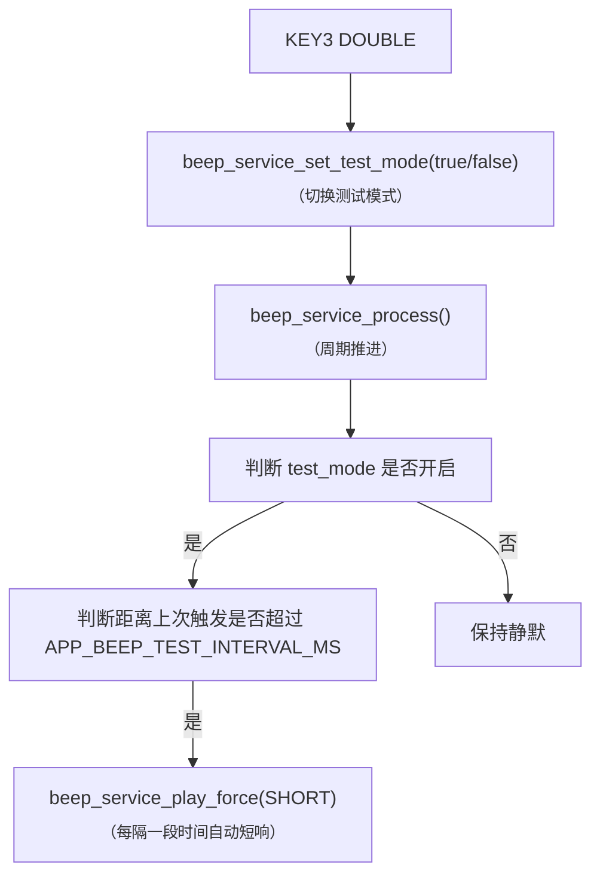
```mermaid
flowchart TD
    A["KEY3 DOUBLE"] --> B["beep_service_set_test_mode(true/false)<br/><sub>（切换测试模式）</sub>"]
    B --> C["beep_service_process()<br/><sub>（周期推进）</sub>"]
    C --> D["判断 test_mode 是否开启"]
    D -->|是| E["判断距离上次触发是否超过 APP_BEEP_TEST_INTERVAL_MS"]
    E -->|是| F["beep_service_play_force(SHORT)<br/><sub>（每隔一段时间自动短响）</sub>"]
    D -->|否| G["保持静默"]
```

## 9. 关键函数调用关系总览

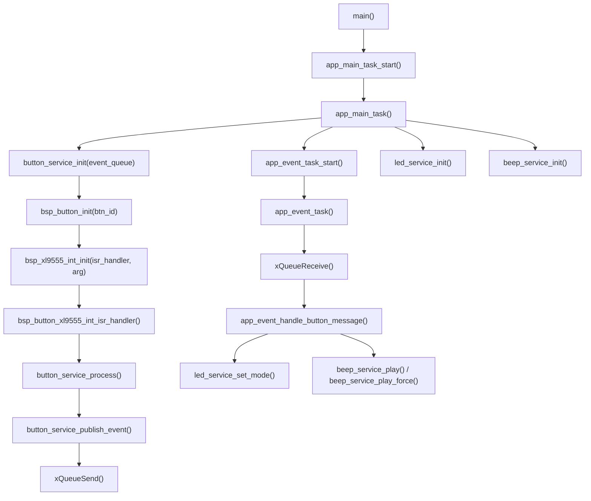
```mermaid
flowchart TD
    A["main()"] --> B["app_main_task_start()"]
    B --> C["app_main_task()"]
    C --> D["app_event_task_start()"]
    C --> E["button_service_init(event_queue)"]
    C --> F["led_service_init()"]
    C --> G["beep_service_init()"]
    E --> H["bsp_button_init(btn_id)"]
    H --> I["bsp_xl9555_int_init(isr_handler, arg)"]
    I --> J["bsp_button_xl9555_int_isr_handler()"]
    J --> K["button_service_process()"]
    K --> L["button_service_publish_event()"]
    L --> M["xQueueSend()"]
    D --> N["app_event_task()"]
    N --> O["xQueueReceive()"]
    O --> P["app_event_handle_button_message()"]
    P --> Q["led_service_set_mode()"]
    P --> R["beep_service_play() / beep_service_play_force()"]
```

## 10. 分模块函数关系图

### 10.1 `bsp_xl9555.c`

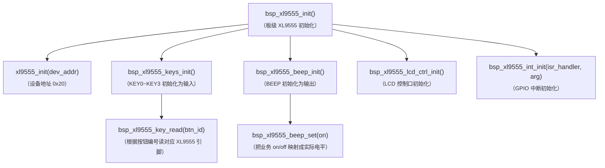
```mermaid
flowchart TD
    A["bsp_xl9555_init()<br/><sub>（板级 XL9555 初始化）</sub>"] --> B["xl9555_init(dev_addr)<br/><sub>（设备地址 0x20）</sub>"]
    A --> C["bsp_xl9555_keys_init()<br/><sub>（KEY0~KEY3 初始化为输入）</sub>"]
    A --> D["bsp_xl9555_beep_init()<br/><sub>（BEEP 初始化为输出）</sub>"]
    A --> E["bsp_xl9555_lcd_ctrl_init()<br/><sub>（LCD 控制口初始化）</sub>"]
    A --> F["bsp_xl9555_int_init(isr_handler, arg)<br/><sub>（GPIO 中断初始化）</sub>"]
    C --> G["bsp_xl9555_key_read(btn_id)<br/><sub>（根据按钮编号读对应 XL9555 引脚）</sub>"]
    D --> H["bsp_xl9555_beep_set(on)<br/><sub>（把业务 on/off 映射成实际电平）</sub>"]
```

### 10.2 `button_service.c`

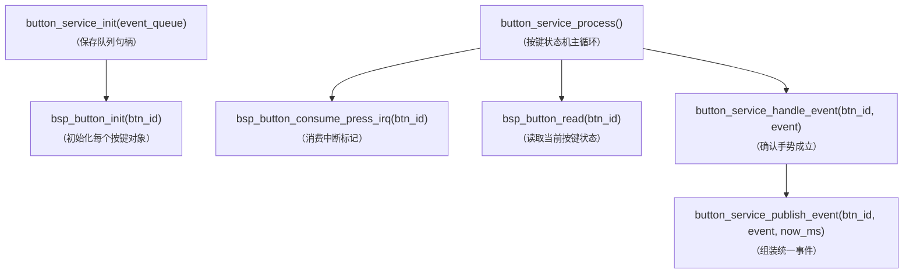
```mermaid
flowchart TD
    A["button_service_init(event_queue)<br/><sub>（保存队列句柄）</sub>"] --> B["bsp_button_init(btn_id)<br/><sub>（初始化每个按键对象）</sub>"]
    C["button_service_process()<br/><sub>（按键状态机主循环）</sub>"] --> D["bsp_button_consume_press_irq(btn_id)<br/><sub>（消费中断标记）</sub>"]
    C --> E["bsp_button_read(btn_id)<br/><sub>（读取当前按键状态）</sub>"]
    C --> F["button_service_handle_event(btn_id, event)<br/><sub>（确认手势成立）</sub>"]
    F --> G["button_service_publish_event(btn_id, event, now_ms)<br/><sub>（组装统一事件）</sub>"]
```

### 10.3 `app_event_task.c`

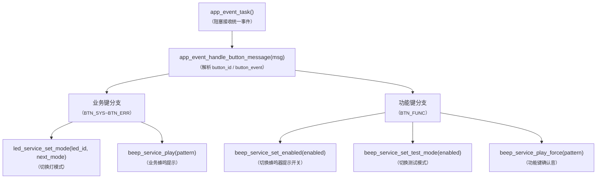
```mermaid
flowchart TD
    A["app_event_task()<br/><sub>（阻塞接收统一事件）</sub>"] --> B["app_event_handle_button_message(msg)<br/><sub>（解析 button_id / button_event）</sub>"]
    B --> C["业务键分支<br/><sub>（BTN_SYS~BTN_ERR）</sub>"]
    B --> D["功能键分支<br/><sub>（BTN_FUNC）</sub>"]
    C --> E["led_service_set_mode(led_id, next_mode)<br/><sub>（切换灯模式）</sub>"]
    C --> F["beep_service_play(pattern)<br/><sub>（业务蜂鸣提示）</sub>"]
    D --> G["beep_service_set_enabled(enabled)<br/><sub>（切换蜂鸣器提示开关）</sub>"]
    D --> H["beep_service_set_test_mode(enabled)<br/><sub>（切换测试模式）</sub>"]
    D --> I["beep_service_play_force(pattern)<br/><sub>（功能键确认音）</sub>"]
```

### 10.4 `beep_service.c`

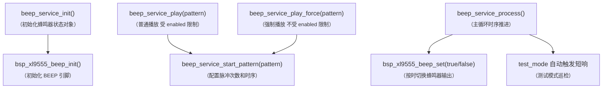
```mermaid
flowchart TD
    A["beep_service_init()<br/><sub>（初始化蜂鸣器状态对象）</sub>"] --> B["bsp_xl9555_beep_init()<br/><sub>（初始化 BEEP 引脚）</sub>"]
    C["beep_service_play(pattern)<br/><sub>（普通播放 受 enabled 限制）</sub>"] --> D["beep_service_start_pattern(pattern)<br/><sub>（配置脉冲次数和时序）</sub>"]
    E["beep_service_play_force(pattern)<br/><sub>（强制播放 不受 enabled 限制）</sub>"] --> D
    F["beep_service_process()<br/><sub>（主循环时序推进）</sub>"] --> G["bsp_xl9555_beep_set(true/false)<br/><sub>（按时切换蜂鸣器输出）</sub>"]
    F --> H["test_mode 自动触发短响<br/><sub>（测试模式巡检）</sub>"]
```

## 11. 还需要补哪一块流程才更容易理解

如果从“理解运行逻辑”的角度，我觉得除了你提的 3 块，还最值得补的是：

- 主循环时序推进图
  - 这个我已经加进来了
  - 因为很多逻辑不是在一个函数里一次做完，而是靠主循环周期推进

如果后面你还想再深入一层，我建议下一步最值得单独补的是：

- `button_service` 内部状态机时序图
  - 尤其是 `IRQ -> 消抖 -> 单击 / 长按 / 双击` 的时序关系
- `beep_service` 脉冲时序图
  - 短响、双响、长响三种 pattern 的时间轴

## 12. button_service 状态机时序图

这一块帮助你把“中断来了以后，为什么还要继续靠状态机判断单击 / 长按 / 双击”看清楚。

### 12.1 单击时序图

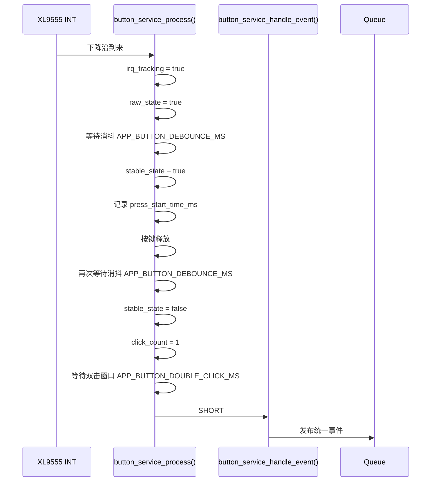
```mermaid
sequenceDiagram
    participant INT as XL9555 INT
    participant BTN as button_service_process()
    participant EVT as button_service_handle_event()
    participant QUEUE as Queue

    INT->>BTN: 下降沿到来
    BTN->>BTN: irq_tracking = true
    BTN->>BTN: raw_state = true
    BTN->>BTN: 等待消抖 APP_BUTTON_DEBOUNCE_MS
    BTN->>BTN: stable_state = true
    BTN->>BTN: 记录 press_start_time_ms
    BTN->>BTN: 按键释放
    BTN->>BTN: 再次等待消抖 APP_BUTTON_DEBOUNCE_MS
    BTN->>BTN: stable_state = false
    BTN->>BTN: click_count = 1
    BTN->>BTN: 等待双击窗口 APP_BUTTON_DOUBLE_CLICK_MS
    BTN->>EVT: SHORT
    EVT->>QUEUE: 发布统一事件
```

### 12.2 长按时序图

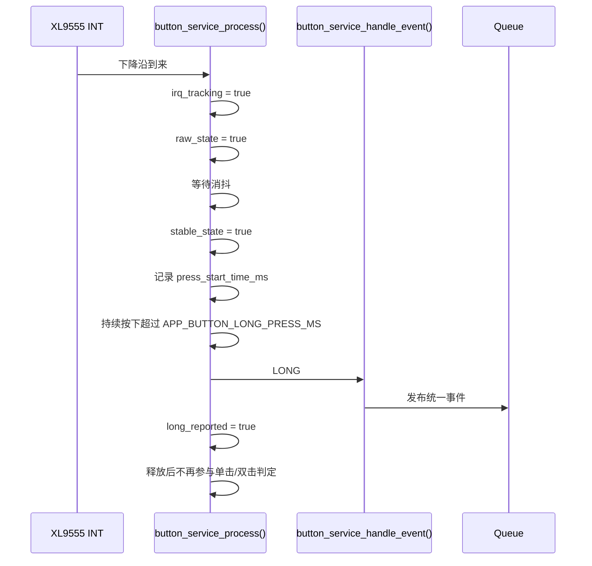
```mermaid
sequenceDiagram
    participant INT as XL9555 INT
    participant BTN as button_service_process()
    participant EVT as button_service_handle_event()
    participant QUEUE as Queue

    INT->>BTN: 下降沿到来
    BTN->>BTN: irq_tracking = true
    BTN->>BTN: raw_state = true
    BTN->>BTN: 等待消抖
    BTN->>BTN: stable_state = true
    BTN->>BTN: 记录 press_start_time_ms
    BTN->>BTN: 持续按下超过 APP_BUTTON_LONG_PRESS_MS
    BTN->>EVT: LONG
    EVT->>QUEUE: 发布统一事件
    BTN->>BTN: long_reported = true
    BTN->>BTN: 释放后不再参与单击/双击判定
```

### 12.3 双击时序图

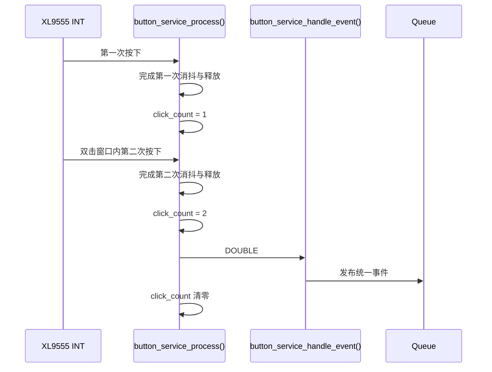
```mermaid
sequenceDiagram
    participant INT as XL9555 INT
    participant BTN as button_service_process()
    participant EVT as button_service_handle_event()
    participant QUEUE as Queue

    INT->>BTN: 第一次按下
    BTN->>BTN: 完成第一次消抖与释放
    BTN->>BTN: click_count = 1
    INT->>BTN: 双击窗口内第二次按下
    BTN->>BTN: 完成第二次消抖与释放
    BTN->>BTN: click_count = 2
    BTN->>EVT: DOUBLE
    EVT->>QUEUE: 发布统一事件
    BTN->>BTN: click_count 清零
```

## 13. beep_service 脉冲时序图

这一块帮助理解为什么蜂鸣器没有在 `app_event_task` 里直接 `delay`，而是交给 `beep_service_process()` 周期推进。

### 13.1 短响时序图

```mermaid
sequenceDiagram
    participant EVT as app_event_task()
    participant BEEP as beep_service_play(SHORT)
    participant PROC as beep_service_process()
    participant BSP as bsp_xl9555_beep_set()

    EVT->>BEEP: pattern = SHORT
    BEEP->>BEEP: remaining_pulses = 1
    BEEP->>BEEP: on_ms = APP_BEEP_SHORT_ON_MS
    BEEP->>BSP: 输出打开
    loop 主循环周期推进
        PROC->>PROC: 判断是否到 on_ms
    end
    PROC->>BSP: 输出关闭
    PROC->>PROC: sequence_active = false
```

### 13.2 双响时序图

```mermaid
sequenceDiagram
    participant EVT as app_event_task()
    participant BEEP as beep_service_play(DOUBLE)
    participant PROC as beep_service_process()
    participant BSP as bsp_xl9555_beep_set()

    EVT->>BEEP: pattern = DOUBLE
    BEEP->>BEEP: remaining_pulses = 2
    BEEP->>BSP: 第一次打开
    PROC->>BSP: 第一次关闭
    PROC->>BSP: 第二次打开
    PROC->>BSP: 第二次关闭
    PROC->>PROC: sequence_active = false
```

### 13.3 长响时序图

```mermaid
sequenceDiagram
    participant EVT as app_event_task()
    participant BEEP as beep_service_play(LONG)
    participant PROC as beep_service_process()
    participant BSP as bsp_xl9555_beep_set()

    EVT->>BEEP: pattern = LONG
    BEEP->>BEEP: remaining_pulses = 1
    BEEP->>BEEP: on_ms = APP_BEEP_LONG_ON_MS
    BEEP->>BSP: 输出打开
    loop 主循环周期推进
        PROC->>PROC: 判断是否到 long on_ms
    end
    PROC->>BSP: 输出关闭
    PROC->>PROC: sequence_active = false
```

### 13.4 测试模式时序图

```mermaid
sequenceDiagram
    participant KEY3 as KEY3 DOUBLE
    participant EVT as app_event_task()
    participant BEEP as beep_service_set_test_mode()
    participant PROC as beep_service_process()

    KEY3->>EVT: BTN_FUNC + DOUBLE
    EVT->>BEEP: test_mode = true
    loop 每个主循环周期
        PROC->>PROC: 判断 test_mode 是否开启
        PROC->>PROC: 判断是否超过 APP_BEEP_TEST_INTERVAL_MS
        PROC->>PROC: 触发一次 SHORT pattern
    end
```

## 14. 推荐阅读顺序

建议后面阅读代码时按下面顺序看：

1. 项目总流程图
2. 主循环时序推进图
3. 统一事件消息与参数传递图
4. 按键总流程图
5. BEEP 蜂鸣器完整流程图
6. button_service 状态机时序图
7. beep_service 脉冲时序图
8. 分模块函数关系图

这样会更容易理解这一版“板载输入输出协同”的设计思路和代码运行逻辑。
