# v1.4.0 项目的事件和函数关系流程表

## 1. 版本定位

`v1.4.0` 是当前工程第一次正式进入显示系统阶段。  
这一版的目标不是做复杂界面，而是先把下面这条链做成模板：

- `SPI` 通用总线层
- `LCD_ST7789V` 驱动层
- `BSP LCD` 板级适配层
- `display_service` 显示服务层

这样后面改显示内容时，尽量只调用显示服务接口，不直接去改底层驱动。

## 2. 总体模块关系图

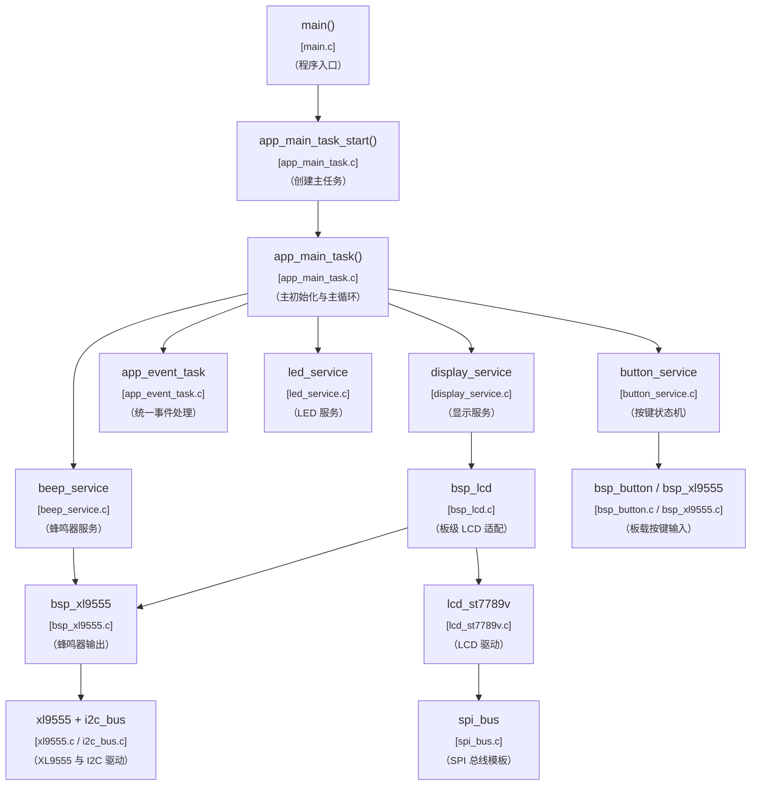

说明：

- `display_service` 不直接碰 `SPI`，而是通过 `bsp_lcd -> lcd_st7789v -> spi_bus`
- `RST / PWR` 仍由 `XL9555` 控制，所以 LCD 初始化前，`XL9555` 必须已经就绪
- 这版之后，屏幕显示会和 `LED / BEEP / 按键` 一样，成为统一事件链的一个输出端

## 3. 总体初始化流程图

这张图是本版最重要的一张。  
它帮助你理解：为什么显示系统不是单独孤立起来初始化，而是要插进现有工程初始化链里。

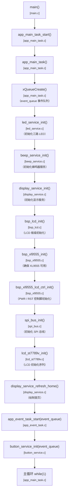

说明：

- `display_service_init()` 放在输入服务前面，是为了上电后尽快看到基础状态页面
- `bsp_lcd_init()` 里会依赖 `XL9555` 去控制 `RST / PWR`
- `lcd_st7789v_init()` 只关心屏幕芯片如何初始化，不关心当前项目要显示什么

## 4. 主循环推进图

这张图帮助理解 `v1.4.0` 后主循环里多出来的显示刷新位置。

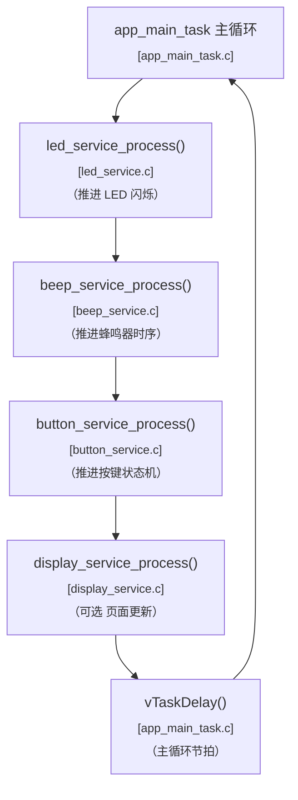

说明：

- 如果本版显示采用“事件触发更新为主”，`display_service_process()` 可以很轻，甚至只做少量动画或脏区刷新
- 这样做的好处是：屏幕更新不会破坏现有的输入输出链节奏

## 5. 初始化依赖关系图

这张图专门回答一个很常见的问题：  
为什么现在很多模块内部都会“先确保依赖已经初始化”，而不是所有东西都只在最外层初始化一次。

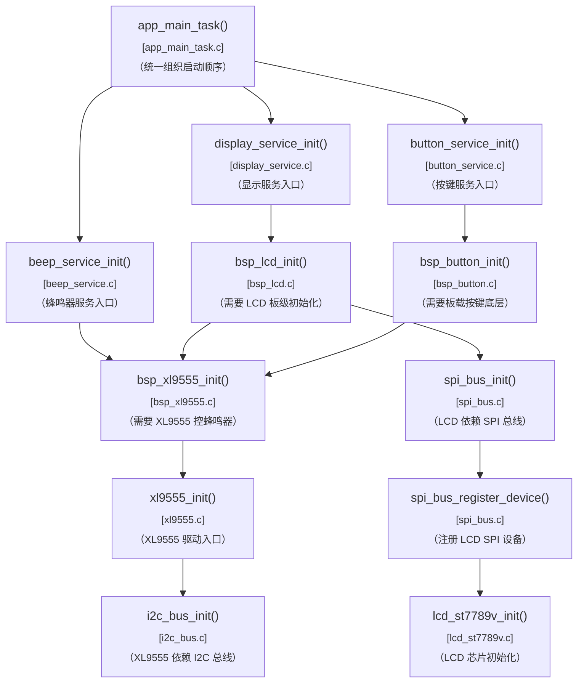

说明：

- 现在项目采用的是“上层统一组织初始化 + 下层模块保留依赖自检”的混合方式
- 好处是：`app_main_task()` 里能看到主启动顺序，同时每个模块单独复用时也不容易忘记前置依赖
- 比如 `display_service_init()` 不直接假设 `XL9555` 和 `SPI` 已经全都准备好，而是通过 `bsp_lcd_init()` 把依赖链串起来
- 这也是为什么你会看到某些 `init()` 函数内部先去调用更底层 `init()`，但由于内部都有 `inited` 保护，真正初始化只会发生一次

## 6. v1.4.0 总体事件流

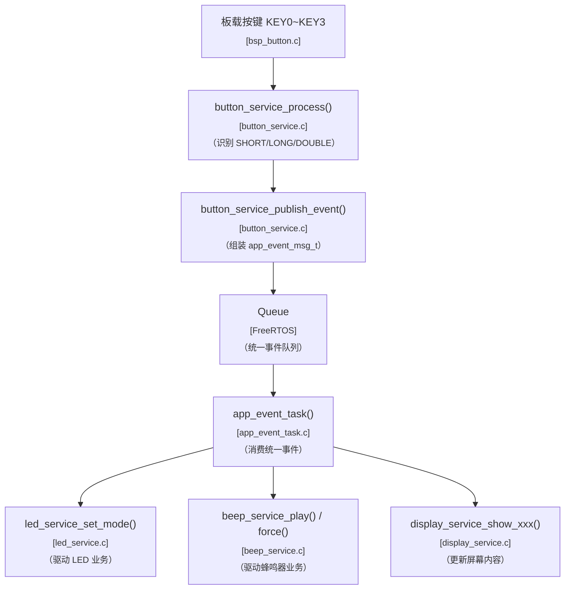

说明：

- `v1.4.0` 最关键的一点，就是让 `LCD` 成为和 `LED / BEEP` 同级的输出端
- 事件任务负责业务分发，显示服务负责把业务状态翻译成屏幕内容

## 7. 统一事件消息与关键参数传递

### 6.1 消息结构图

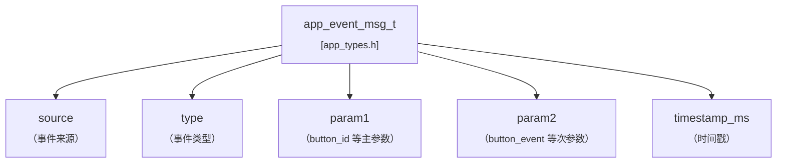

### 6.2 参数传递总图

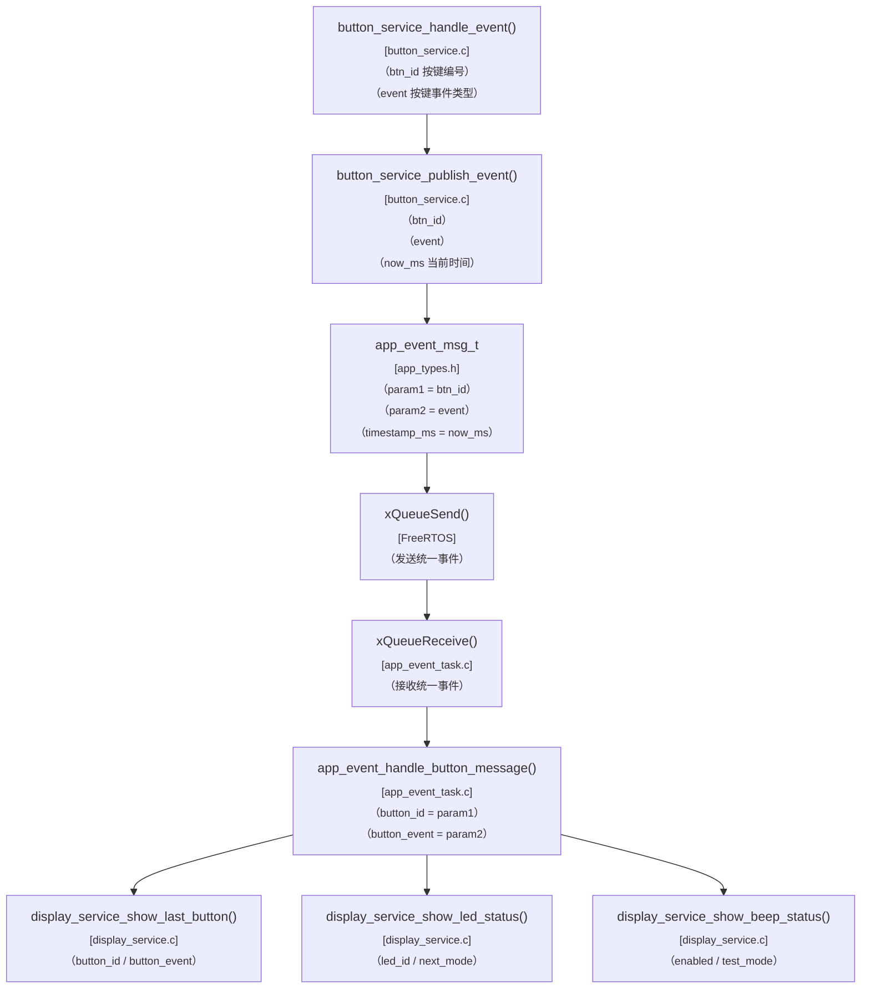

说明：

- `display_service` 不是自己去推导业务，而是接受业务层已经算好的结果
- 这样显示层只承担“展示”，不会反向污染业务逻辑

## 8. LCD 显示模板主链

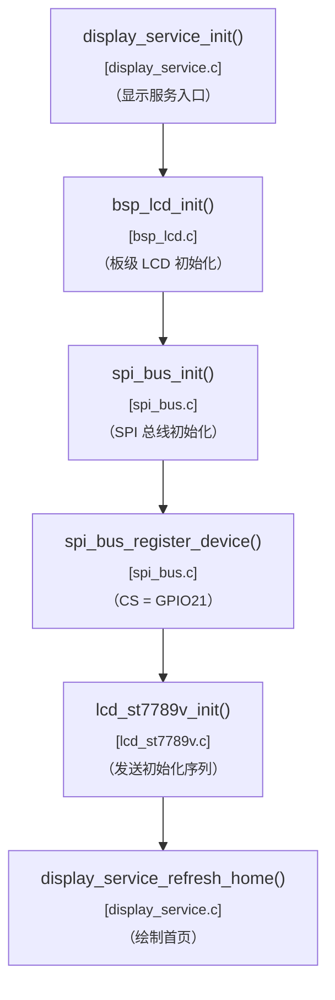

说明：

- `display_service` 是你后面最常直接调用的层
- `lcd_st7789v` 是模板底层，不建议后续业务直接跨层调用

## 9. LCD 板级初始化流程图

这一块专门解释 `RST / PWR` 为什么要走 `XL9555`。

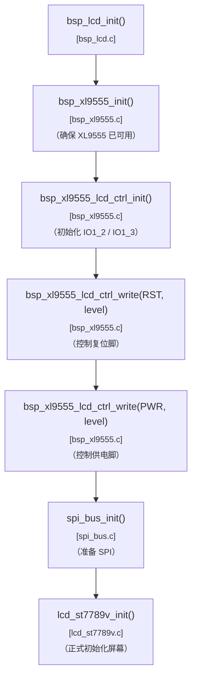

说明：

- 这张图最重要的结论是：
  - `LCD` 初始化依赖 `XL9555`
  - 所以 `XL9555` 这一层必须先于显示层准备好

## 10. SPI 通用驱动流程图

这部分是为了后面复用 `SPI` 模板。

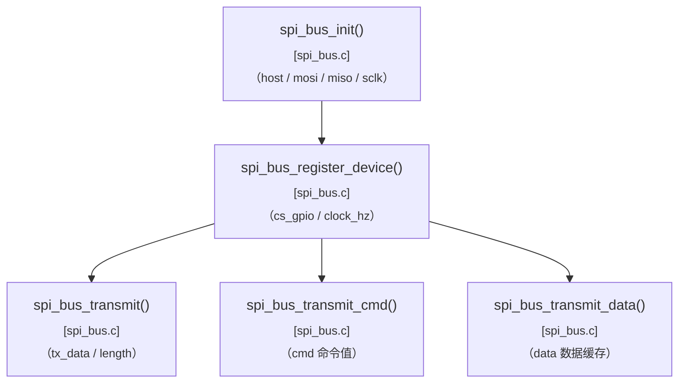

说明：

- `spi_bus` 目标不是只服务 `LCD`
- 后面 `TF 卡` 等 SPI 模块也应该优先复用这一层

## 11. LCD_ST7789V 驱动流程图

这一块重点解释底层显示驱动会承担哪些事情。

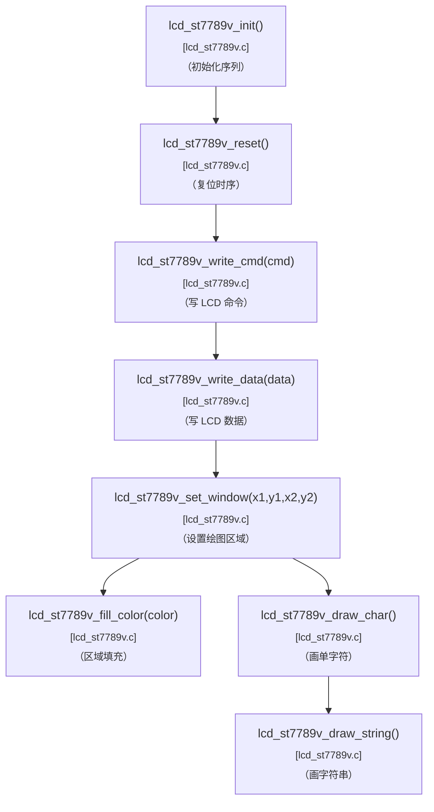

说明：

- 这层的目标是“把屏幕驱动好”
- 不是“知道项目里要显示哪些业务字段”

## 12. display_service 业务显示流程图

这部分是后面你最常直接复用的模板层。

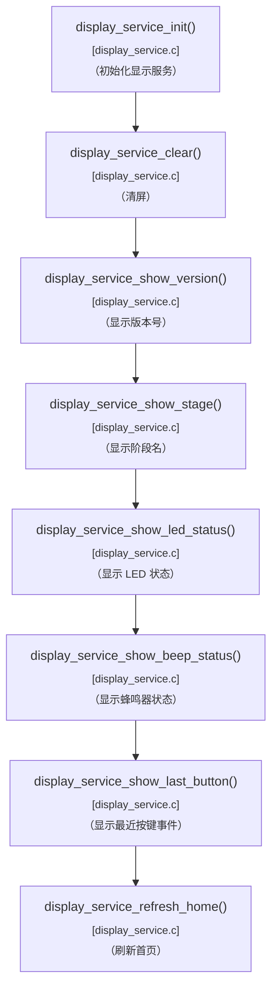

说明：

- 后面改显示内容时，优先改这一层
- 后面业务代码更新屏幕时，也优先调这一层接口

## 13. app_event_task 与显示联动流程图

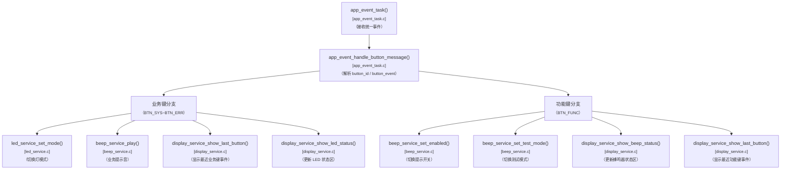

说明：

- 这张图体现了 `LCD` 在事件系统里的位置
- 屏幕不是独立逻辑，而是现有事件链上的一个输出结果

## 14. 预计关键参数映射表

这一块不是流程图，但很适合理解后面代码里的参数。

### 13.1 LCD 板级参数

- `lcd_rst_pin` -> `APP_XL9555_LCD_CTRL1_PIN`
- `lcd_pwr_pin` -> `APP_XL9555_LCD_CTRL0_PIN`
- `spi_mosi_gpio` -> `GPIO11`
- `spi_miso_or_wr_gpio` -> `GPIO13`
- `spi_sck_gpio` -> `GPIO12`
- `spi_cs_gpio` -> `GPIO21`

### 13.2 显示服务输入参数

- `version` -> 当前项目版本号
- `stage` -> 当前阶段名
- `button_id` -> 最近一次按键编号
- `button_event` -> 最近一次按键事件类型
- `led_id / led_mode` -> LED 状态区显示内容
- `beep_enabled / beep_test_mode` -> 蜂鸣器状态区显示内容

## 15. 哪些地方我觉得还值得额外补

如果你后面觉得这版还要再往下细化，我建议最值得再补的是两块：

- `lcd_st7789v` 初始化命令时序图
  - 这样会更容易理解命令 / 数据 / 延时之间的关系
- `display_service` 首页布局示意图
  - 这样写显示代码时会更直观

## 16. 推荐阅读顺序

建议后面阅读 `v1.4.0` 代码时按这个顺序看：

1. 总体模块关系图
2. 总体初始化流程图
3. 主循环推进图
4. SPI 通用驱动流程图
5. LCD_ST7789V 驱动流程图
6. display_service 业务显示流程图
7. app_event_task 与显示联动流程图
8. 最后再看参数映射表和具体源码

这样会最容易把“显示模板”和“现有系统架构”对齐起来。
