# v1.4.1 项目的事件和函数关系流程表

## 1. 版本定位

`v1.4.1` 是 `v1.4.0` 的显示模板收口版。  
这一版不再新增硬件，而是继续把已经跑通的：

- `spi_bus`
- `lcd_st7789v`
- `bsp_lcd`
- `display_service`

这条显示链整理得更适合后续复用。

重点不是“显示更多东西”，而是：

```text
让显示服务的页面结构、函数结构、初始化关系更清楚
```

---

## 2. 总体模块关系图

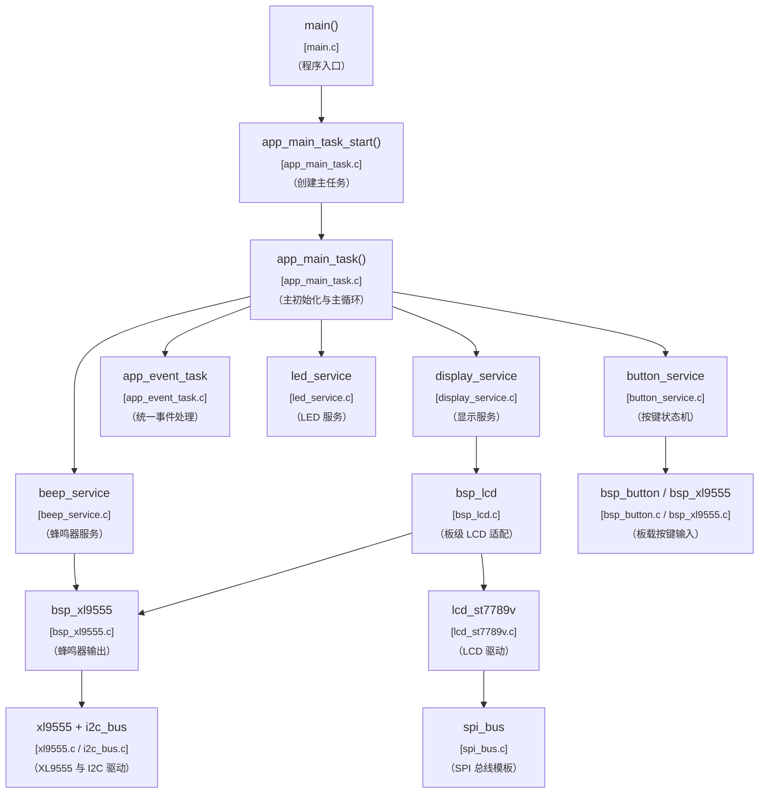

---

## 3. 总体初始化流程图

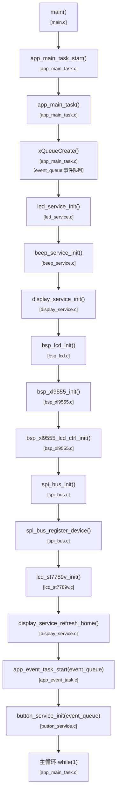

---

## 4. 初始化依赖关系图

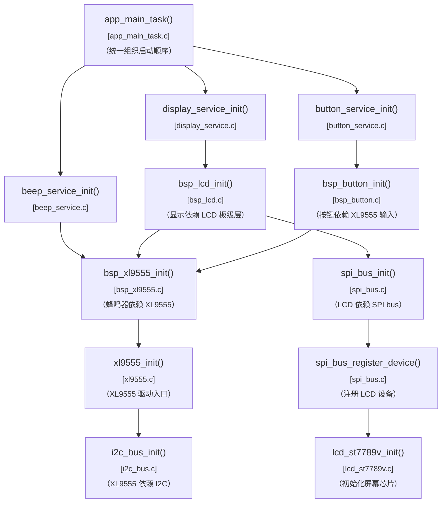

说明：

- 当前项目采用的是“上层统一组织初始化 + 下层模块保留依赖自检”的混合方式
- 这样既能看清主启动顺序，也方便后续单独复用某个模块

---

## 5. 主循环推进图

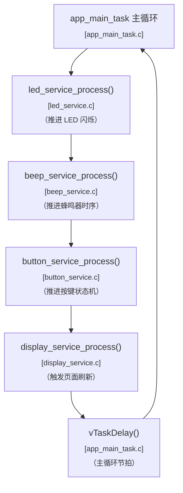

---

## 6. 总体事件流

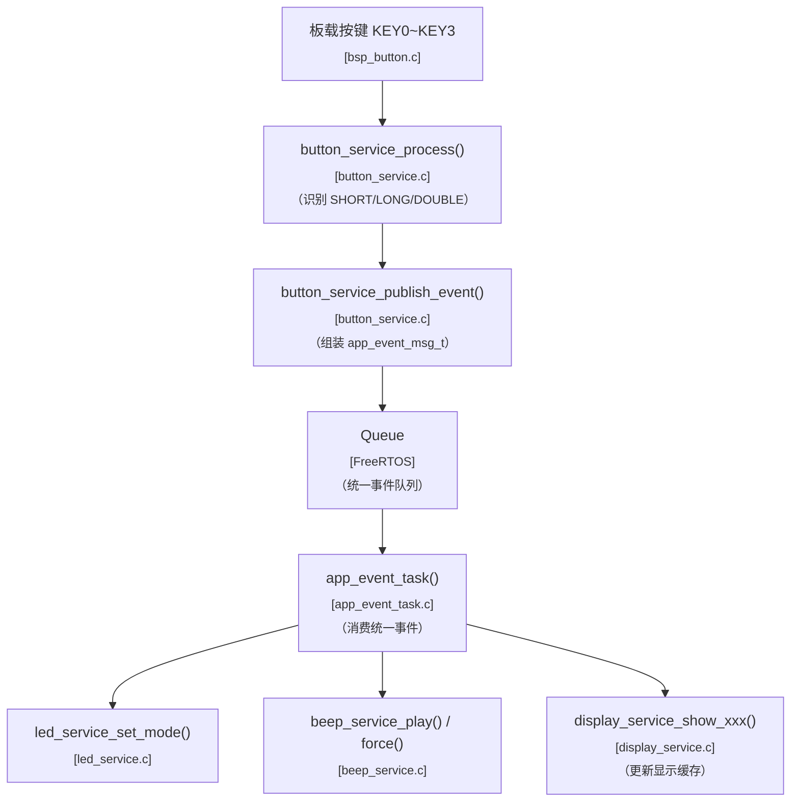

---

## 7. 统一事件消息与关键参数传递

### 7.1 消息结构图

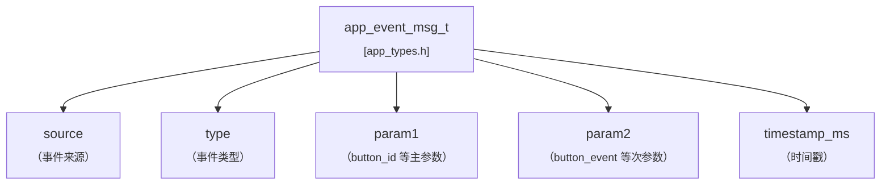

### 7.2 参数传递总图

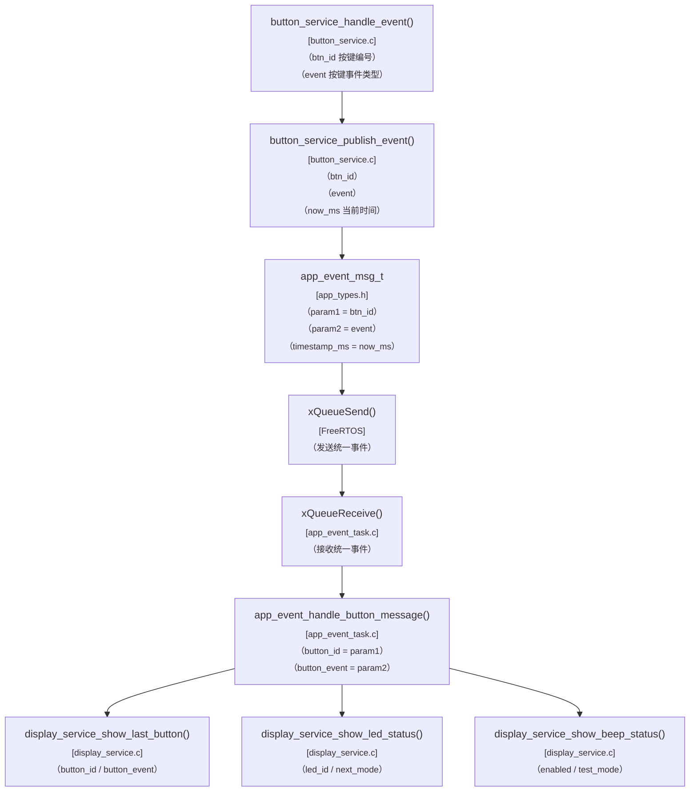

---

## 8. LCD 显示模板主链

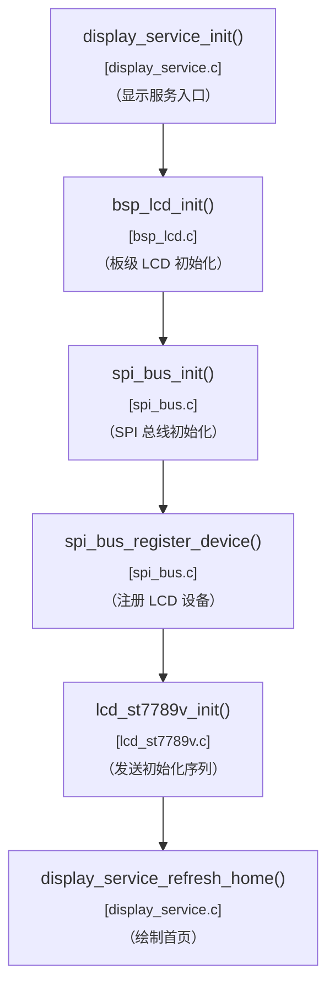

---

## 9. display_service 页面结构图

这一块是 `v1.4.1` 最核心的新增理解视角。  
它不只是看函数调用，而是看“页面被拆成了哪几块”。

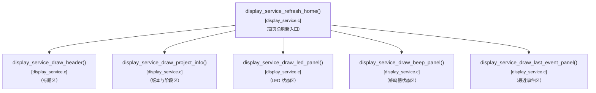

说明：

- 这张图体现的是 `v1.4.1` 最想优化的方向
- 后面不管显示内容怎么增加，建议都优先往“按区域拆函数”的方式发展

---

## 10. display_service 函数关系图

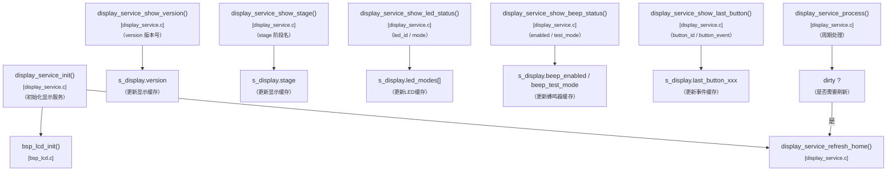

---

## 11. SPI 通用驱动流程图

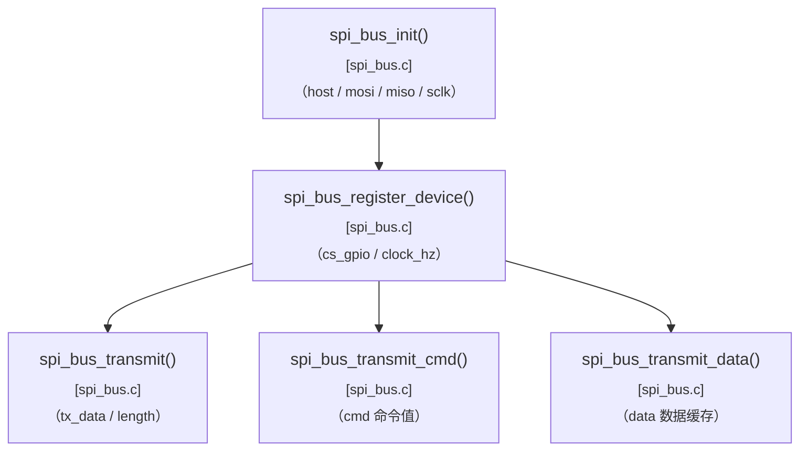

---

## 12. LCD_ST7789V 驱动流程图

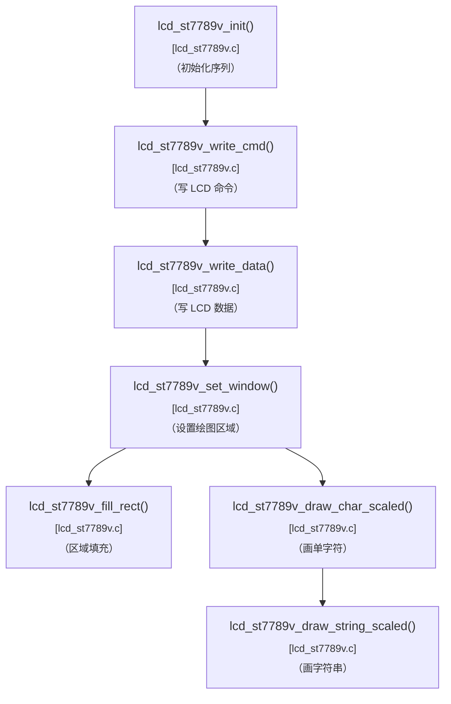

---

## 13. app_event_task 与显示联动流程图

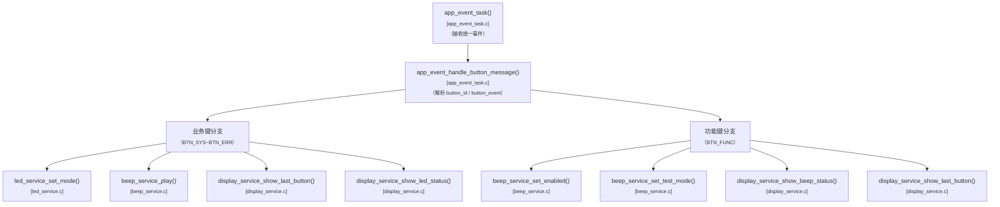

---

## 14. 页面布局参数图

这张图不是调用链，而是帮助后面整理页面布局常量。

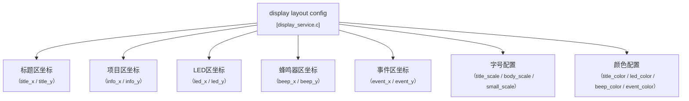

说明：

- `v1.4.1` 很适合把这些布局参数集中出来
- 这样后面改页面时，不用在大段绘制逻辑里到处找数字

---

## 15. 哪些地方我觉得还值得额外补

如果后面这版继续往下细化，我觉得最值得再补的是两块：

- `lcd_st7789v` 初始化命令时序图
- 首页布局示意图

前者更偏驱动理解，后者更偏页面设计理解。

---

## 16. 推荐阅读顺序

建议后面阅读 `v1.4.1` 时按这个顺序看：

1. 总体模块关系图
2. 总体初始化流程图
3. 初始化依赖关系图
4. 主循环推进图
5. 总体事件流
6. LCD 显示模板主链
7. display_service 页面结构图
8. display_service 函数关系图
9. 页面布局参数图
10. 最后再回到具体源码

这样会最容易把“显示模板”和“系统运行逻辑”对齐起来。
