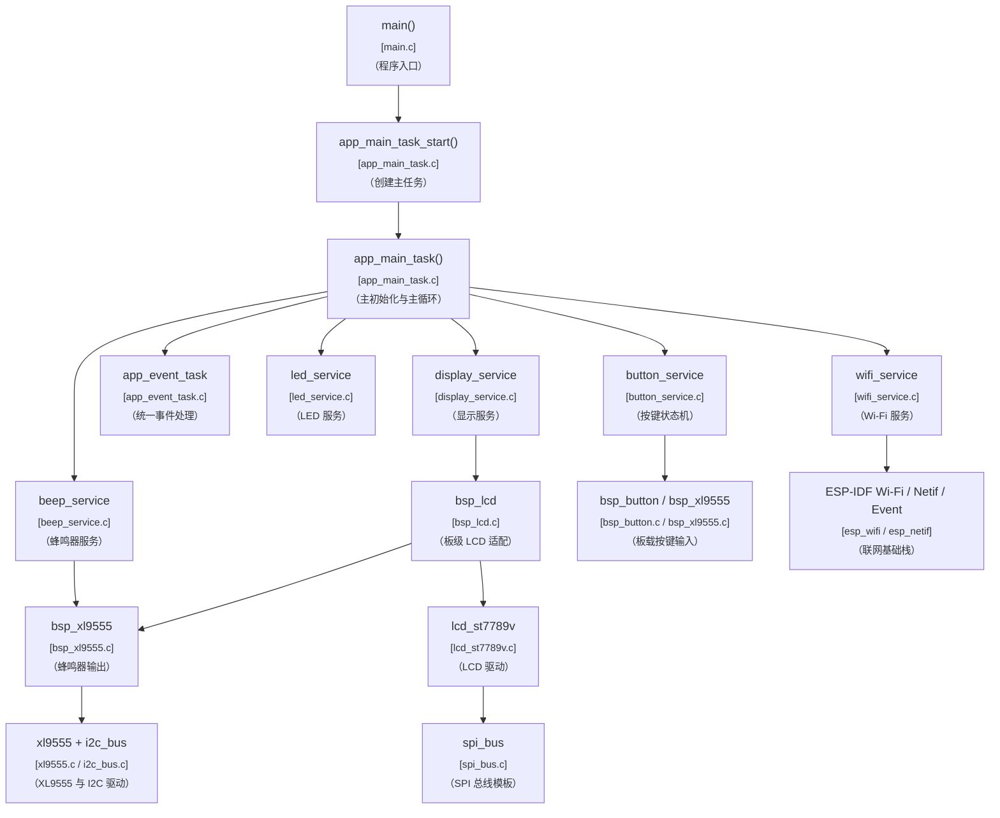
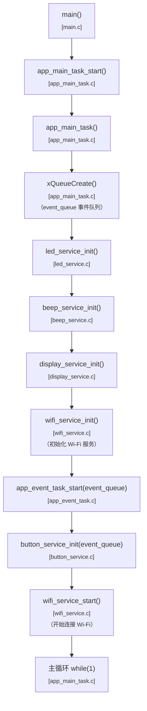
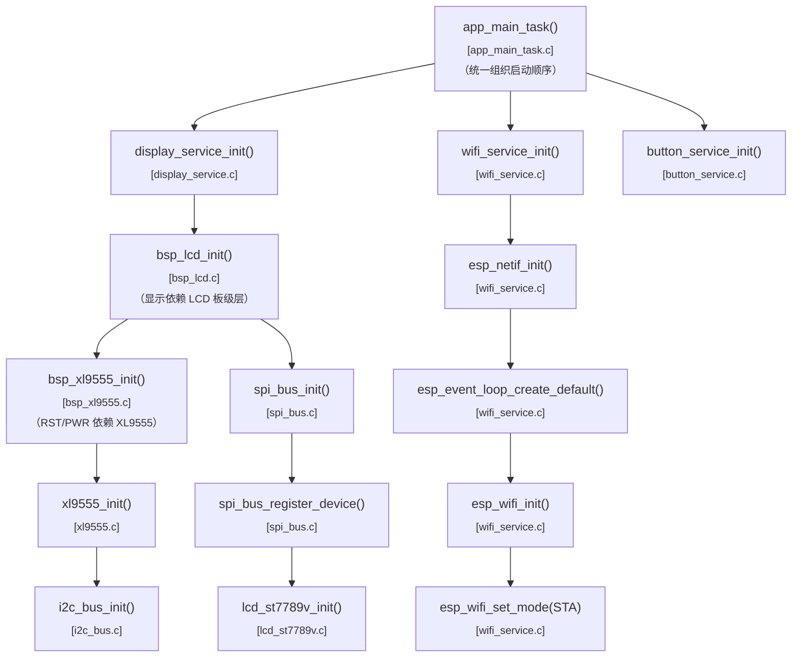
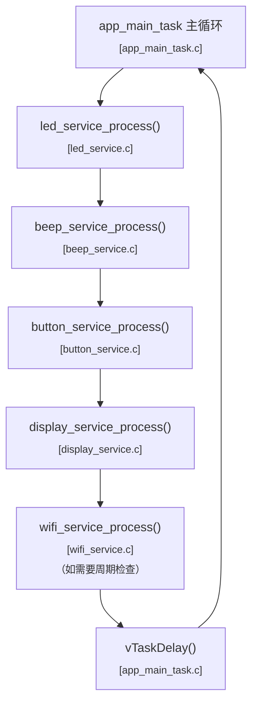
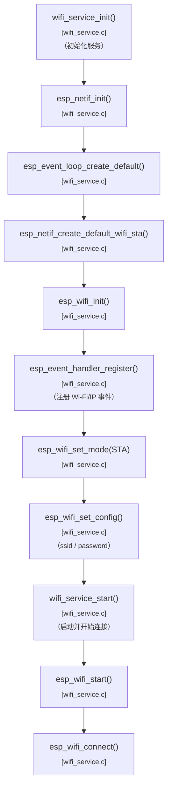
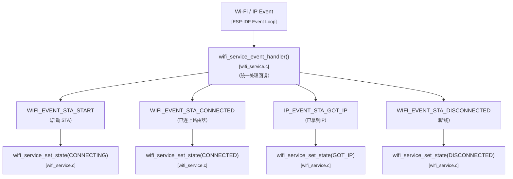
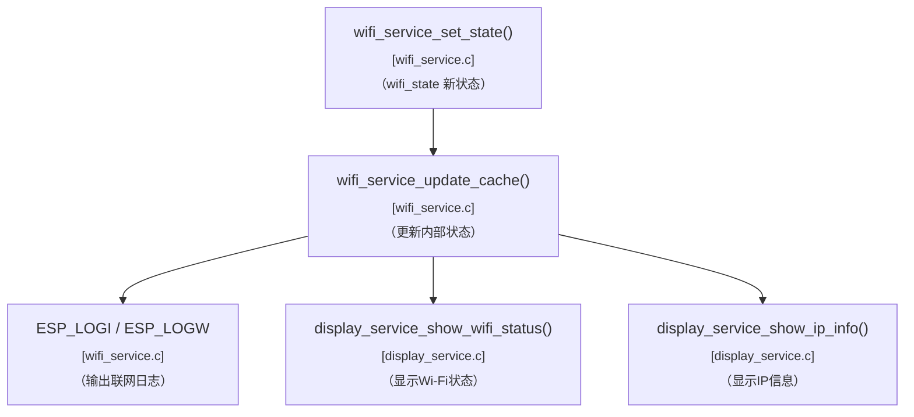
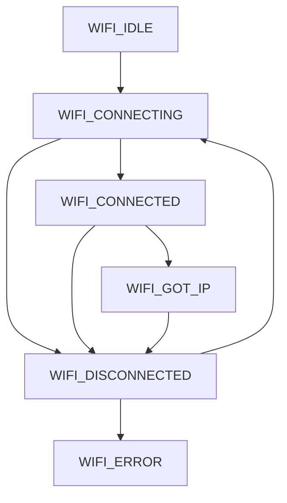
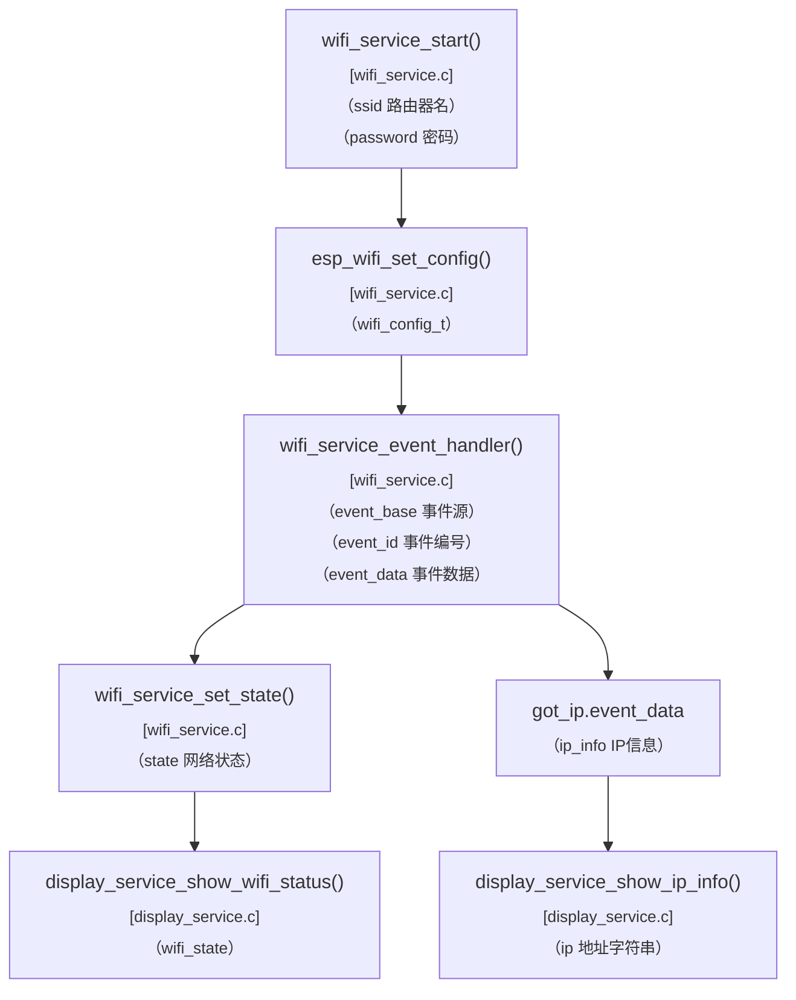
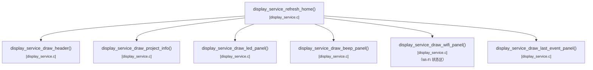

# v1.5.0 项目的事件和函数关系流程表

## 1. 版本定位

`v1.5.0` 是当前项目正式进入联网主线的第一个版本。  
这一版最重要的不是 HTTP 或 OTA，而是先把：

- `Wi-Fi STA`
- 网络状态管理
- 串口与 LCD 联动显示

这条最基础的联网链做稳。

---

## 2. 总体模块关系图

---

## 3. 总体初始化流程图

---

## 4. 初始化依赖关系图

说明：

- `wifi_service` 这一层后面会成为 `HTTP / OTA / AI` 的共同前置基础
- 所以后续网络主线里，建议都把 Wi-Fi 状态作为正式系统状态的一部分

---

## 5. 主循环推进图

---

## 6. Wi-Fi 主流程图

---

## 7. Wi-Fi 事件流图

---

## 8. 网络状态与显示联动图

说明：

- 这版建议把联网状态同步到 LCD
- 后面 `HTTP / OTA / AI` 也都可以继续沿用这一套状态输出思路

---

## 9. Wi-Fi 状态模型图

说明：

- `CONNECTED` 表示已经连上路由器
- `GOT_IP` 表示网络真正可用了
- 后面发 `HTTP` 请求时，通常应该等到 `GOT_IP`

---

## 10. 关键参数传递图

---

## 11. display_service 联网显示结构图

说明：

- `v1.5.0` 很适合在首页上正式加一个 `Wi-Fi` 状态区
- 后面网络主线的很多状态都可以从这里继续扩展

---

## 12. 哪些地方我觉得还值得额外补

如果后面这版继续往下细化，我觉得最值得再补的是两块：

- `Wi-Fi 事件时序图`
- `LCD 首页新增 Wi-Fi 区域布局示意图`

前者更偏联网理解，后者更偏页面组织理解。

---

## 13. 推荐阅读顺序

建议后面阅读 `v1.5.0` 时按这个顺序看：

1. 总体模块关系图
2. 总体初始化流程图
3. 初始化依赖关系图
4. Wi-Fi 主流程图
5. Wi-Fi 事件流图
6. 网络状态与显示联动图
7. Wi-Fi 状态模型图
8. 关键参数传递图
9. display_service 联网显示结构图
10. 最后再回到具体源码

这样会最容易把“联网基础”和“现有系统架构”对齐起来。
