# v1.6.0 项目的事件和函数关系流程表

## 1. 版本定位

`v1.6.0` 是当前项目在 `Wi-Fi` 联网跑通之后，正式进入网络应用层的第一个版本。  
这一版的重点不是继续讨论“能不能联网”，而是：

```text
设备怎么主动发起 HTTP 请求
-> 怎么收到响应
-> 怎么解析 JSON
-> 怎么把结果同步到 LCD 和串口
```

---

## 2. 总体模块关系图

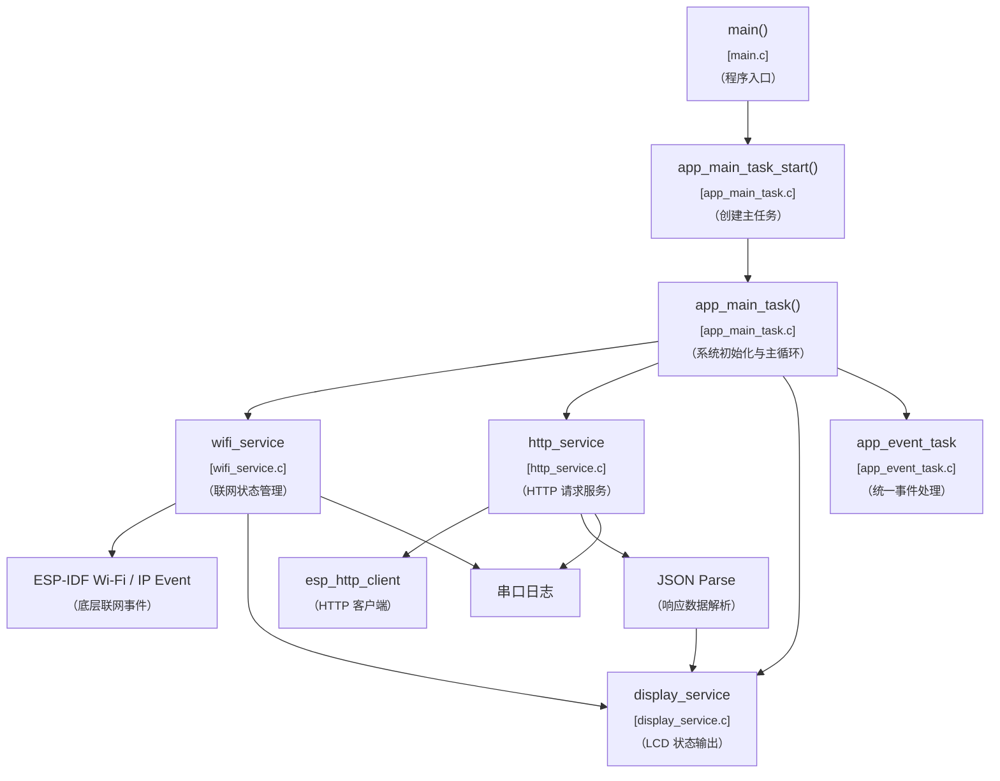

---

## 3. 总体初始化流程图

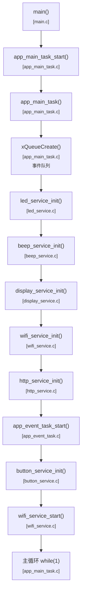

---

## 4. 初始化依赖关系图

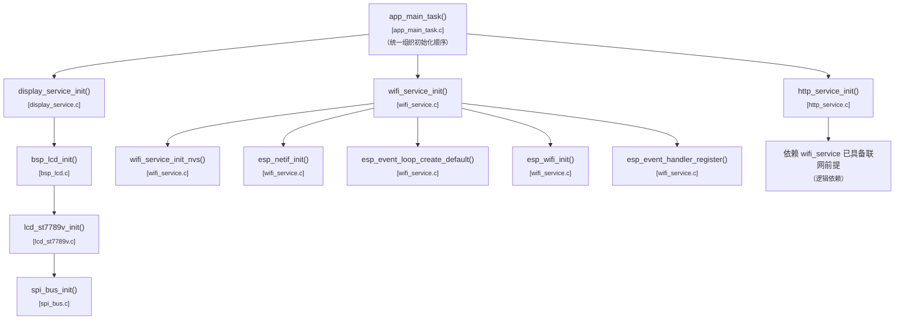

---

## 5. HTTP 主流程图

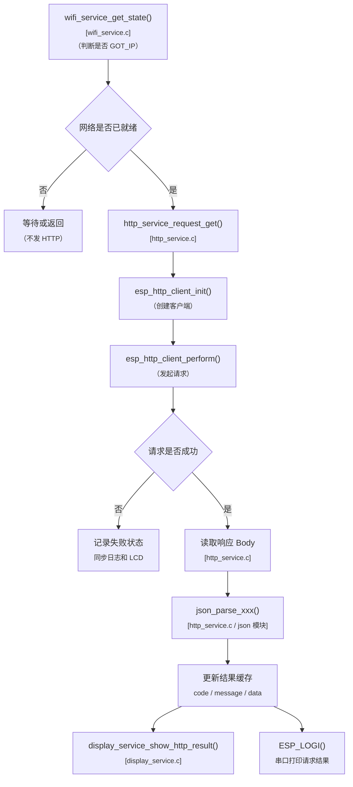

---

## 6. Wi-Fi 与 HTTP 的关系图

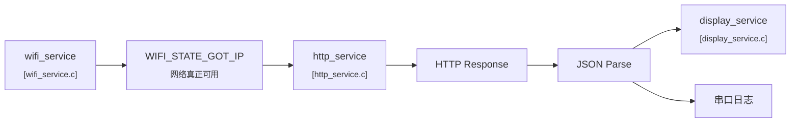

---

## 7. HTTP 请求链函数关系图

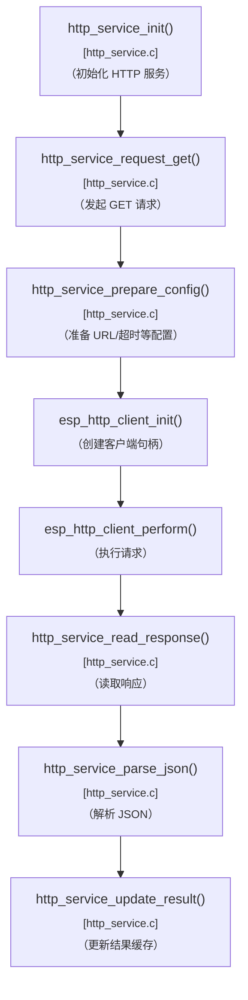

---

## 8. 关键参数传递图

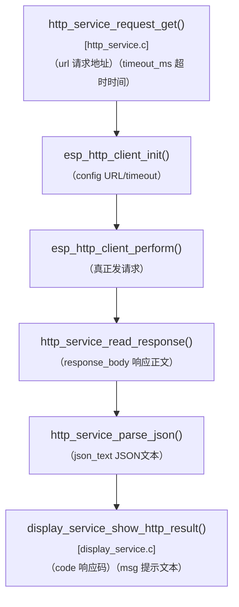

---

## 9. LCD 联动显示流程图

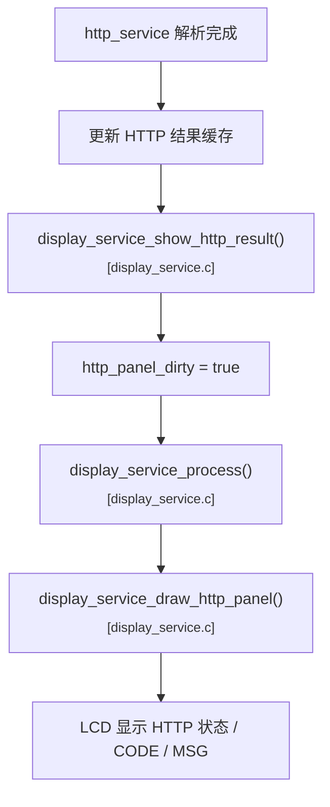

---

## 10. JSON 解析理解图

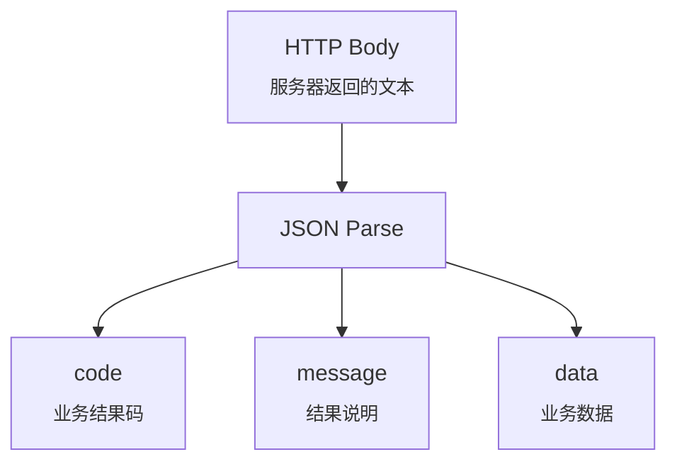

---

## 11. 主循环推进图

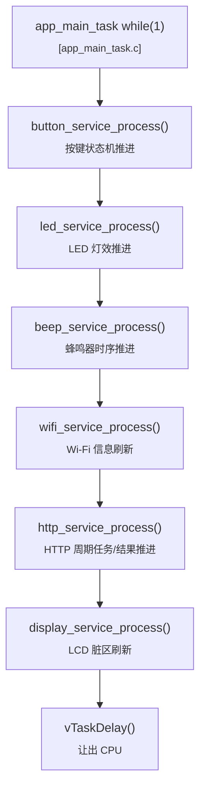

---

## 12. 页面布局建议图

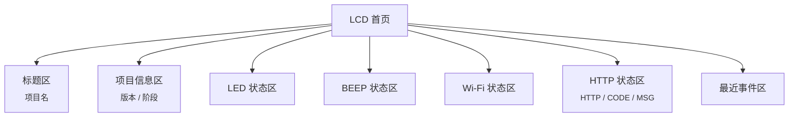

---

## 13. 当前版本最值得理解的运行逻辑

这版最核心的理解是：

```text
Wi-Fi 负责“网络前提”
-> HTTP 负责“访问服务”
-> JSON 负责“提取结构化数据”
-> LCD 和日志负责“把结果表达出来”
```

建议后面看代码时按这个顺序理解：

1. 先看 `wifi_service`
2. 再看 `http_service`
3. 再看 `JSON` 解析部分
4. 最后看 `display_service`

这样最容易把这版的主链吃透。
