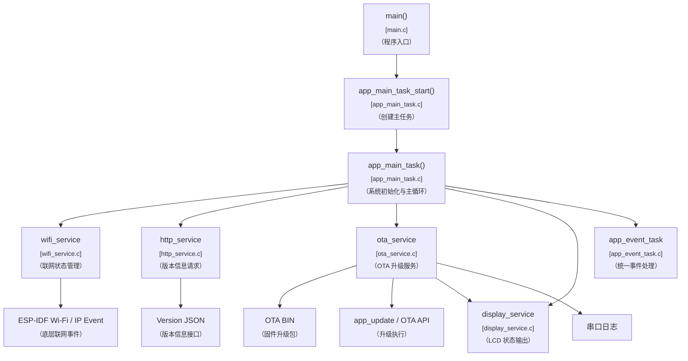
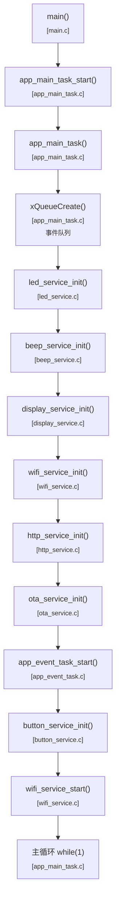
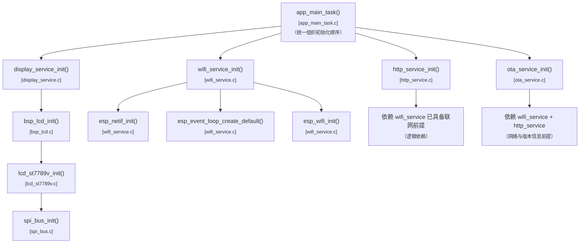
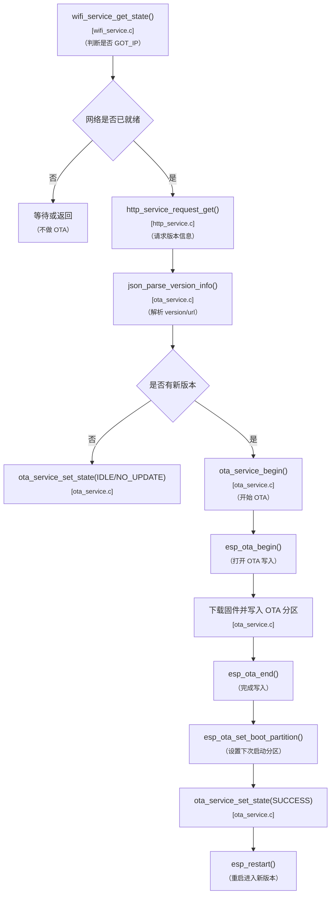
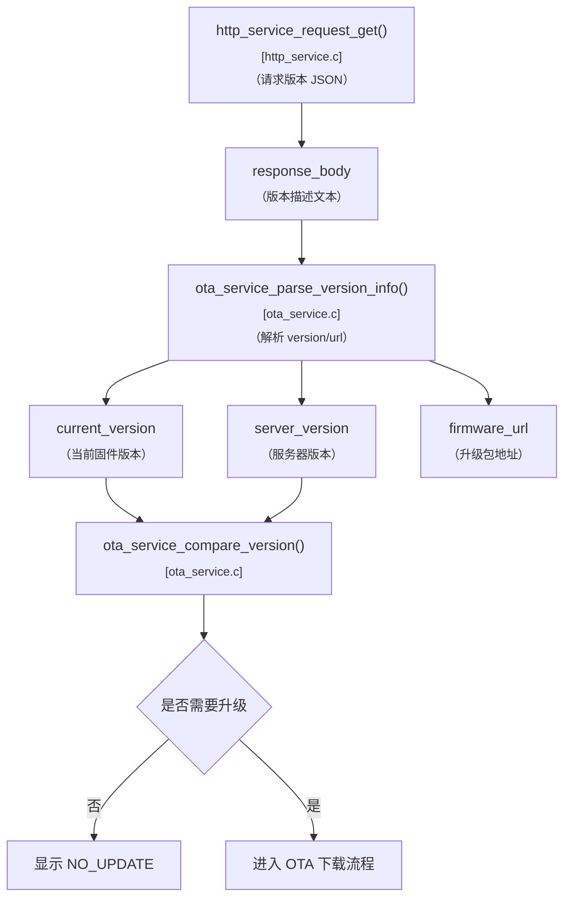
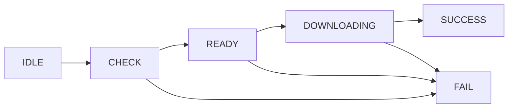
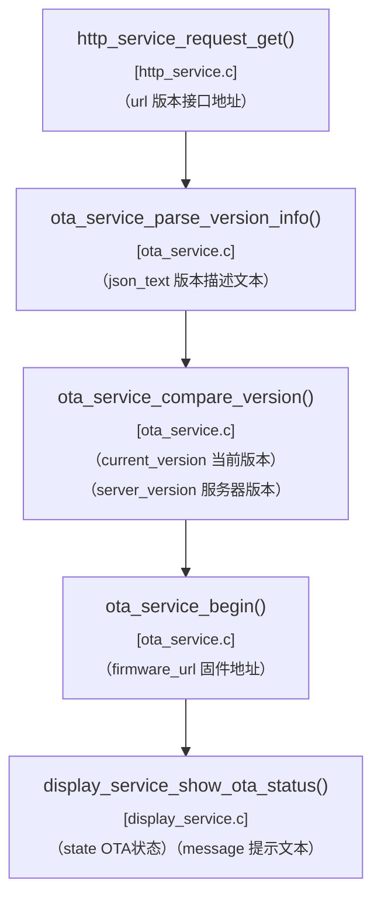
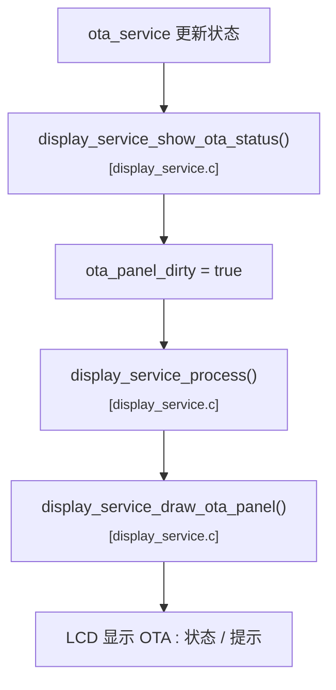
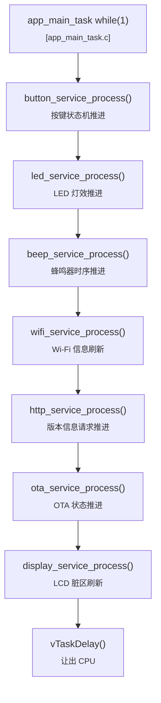
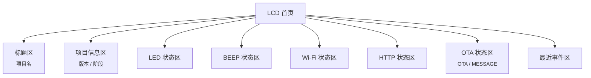

# v1.7.0 项目的事件和函数关系流程表

## 1. 版本定位

`v1.7.0` 是当前项目在完成 `Wi-Fi + HTTP + JSON` 主链之后，正式进入设备远程升级能力的第一个版本。

这一版的重点不是继续验证网络基础，而是：

```text
设备怎么检查新版本
-> 怎么拿到升级地址
-> 怎么执行 OTA
-> 怎么把 OTA 状态同步到 LCD 和串口
```

---

## 2. 总体模块关系图



---

## 3. 总体初始化流程图



---

## 4. 初始化依赖关系图



---

## 5. OTA 主流程图



---

## 6. 版本检查流程图



---

## 7. OTA 状态流图



---

## 8. 关键参数传递图



---

## 9. OTA 与 LCD 联动流程图



---

## 10. 主循环推进图



---

## 11. 页面布局建议图



---

## 12. 当前版本最值得理解的运行逻辑

这版最核心的理解是：

```text
Wi-Fi 负责“网络前提”
-> HTTP 负责“拿版本信息”
-> OTA 负责“下载并切换固件”
-> LCD 和日志负责“把升级状态表达出来”
```

建议后面看代码时按这个顺序理解：

1. 先看 `wifi_service`
2. 再看 `http_service`
3. 再看 `ota_service`
4. 最后看 `display_service`
