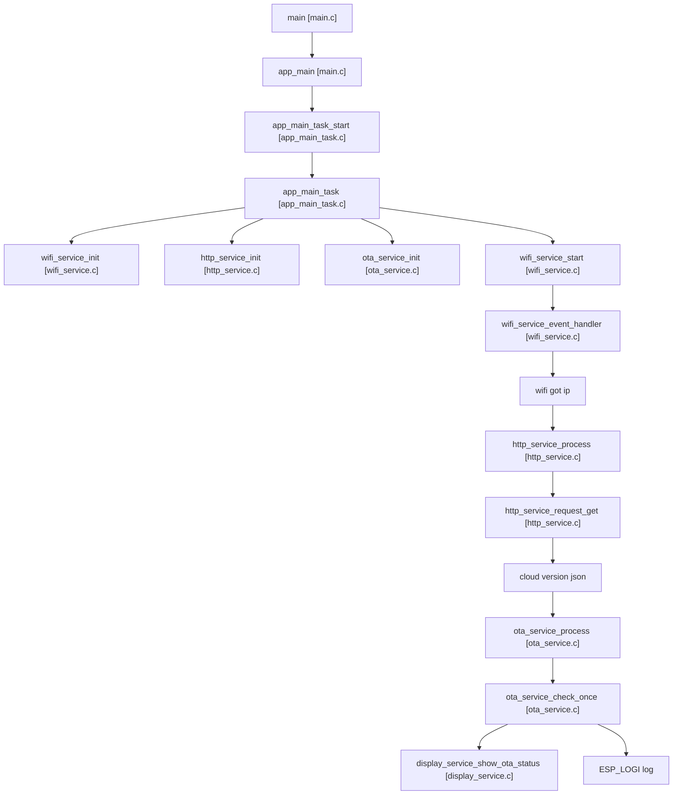
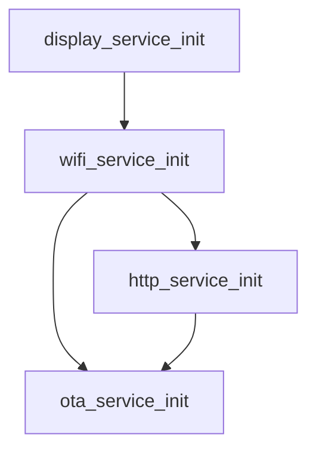
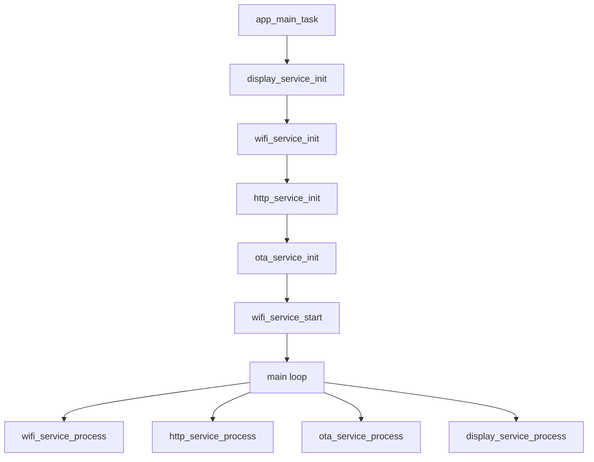
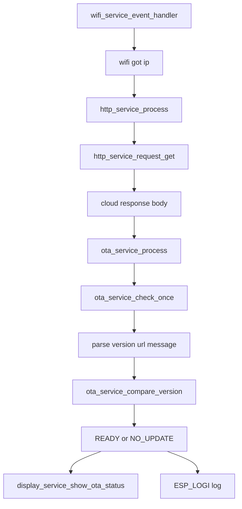
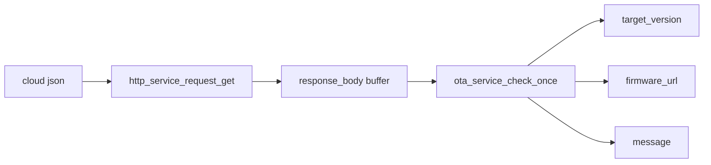
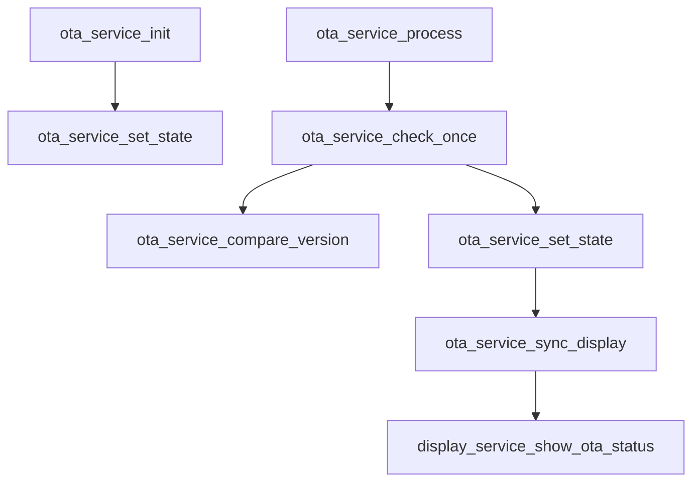
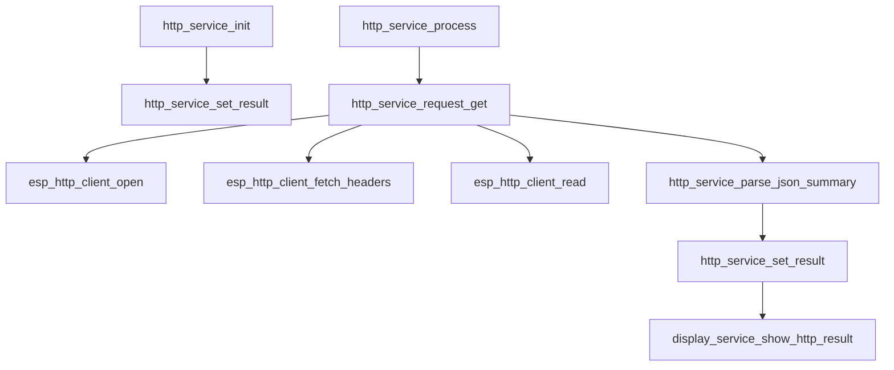
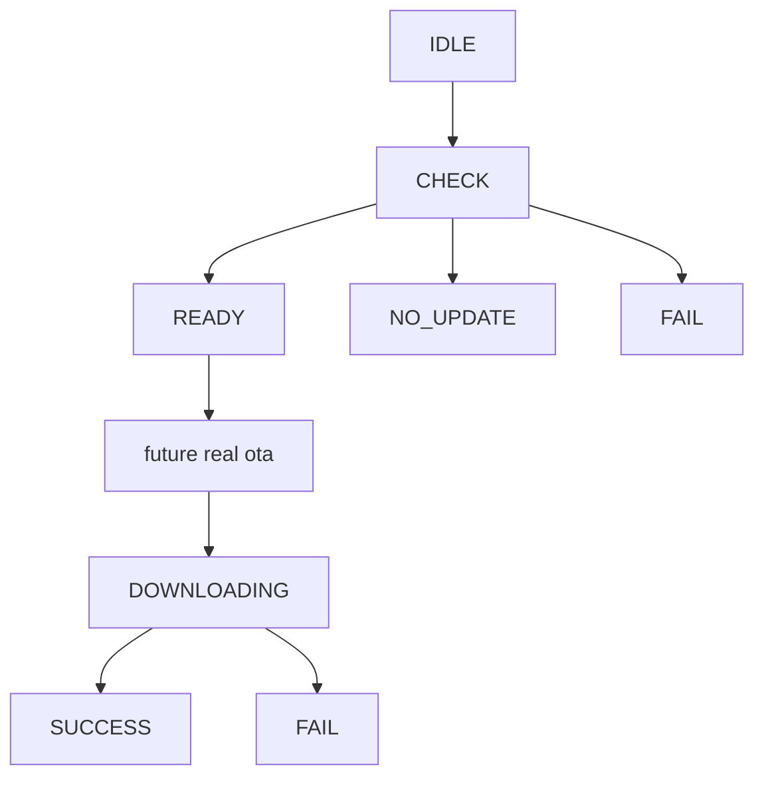
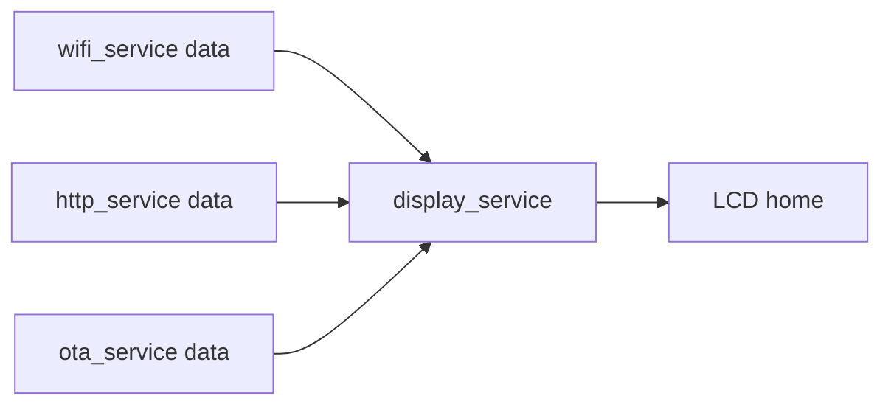
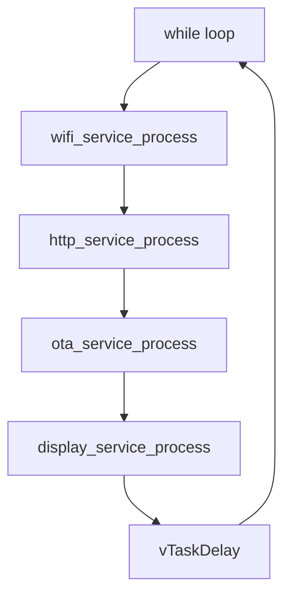

# v1.8.0 项目的事件和函数关系流程表

## 1. 文档定位

这份文档用于说明 `v1.8.0` 的主链关系、初始化依赖、关键事件流和函数调用关系。

本版核心主题是：

```text
云端版本检查
```

也就是把 OTA 从“本地配置模拟”推进到：

```text
真实云端版本 JSON
-> HTTP 获取
-> OTA 解析版本信息
-> LCD 和日志显示结果
```

---

## 2. 本版总体主链



说明：

- `wifi got ip` 表示网络真正可用
- `cloud version json` 表示云端版本接口返回的 JSON

---

## 3. 初始化依赖关系图



说明：

- `display_service` 先准备好，后面的联网、HTTP、OTA 状态变化才能立刻显示
- `http_service` 依赖 `wifi_service`
- `ota_service` 依赖 `wifi_service` 和 `http_service`

---

## 4. 总体初始化流程图



---

## 5. 云端版本检查主流程图



说明：

- `cloud response body` 表示云端接口返回的正文
- `parse version url message` 表示解析三个关键字段：
  - `version`
  - `url`
  - `message`

---

## 6. http_service 到 ota_service 的参数流转图



说明：

- `response_body buffer` 表示 `s_http.response_body`
- `target_version` 表示目标版本号
- `firmware_url` 表示固件下载地址
- `message` 表示显示到 LCD 和日志的说明文字

---

## 7. ota_service 关键函数关系图



---

## 8. http_service 关键函数关系图



---

## 9. OTA 状态流图



当前 `v1.8.0` 实际先做到：

- `IDLE`
- `CHECK`
- `READY`
- `NO_UPDATE`
- `FAIL`

---

## 10. LCD 联动图



说明：

- `wifi_service data` 主要包括：
  - `wifi state`
  - `ip`
  - `rssi`
  - `channel`
- `http_service data` 主要包括：
  - `http result`
  - `status code`
  - `message`
- `ota_service data` 主要包括：
  - `ota state`
  - `message`

建议本版 LCD 重点关注：

- `HTTP : OK or FAIL`
- `CODE : 200 or other`
- `OTA : READY or NO_UPDATE or FAIL`
- `MSG : new firmware available or other`

---

## 11. 主循环推进图



说明：

- `wifi_service` 主要还是事件驱动，`process` 里只做轻量状态刷新
- `http_service` 判断是否发自动请求
- `ota_service` 判断是否执行版本检查
- `display_service` 统一做局部刷新

---

## 12. 当前版本最值得注意的实现点

### 12.1 当前主变化不在 Wi-Fi

这版不是重新学联网，而是基于已有 `Wi-Fi` 去接真实云端版本接口。

### 12.2 当前主变化也不在 HTTP 底层

HTTP 主链已经在 `v1.6.0` 打通，这版重点是让 `ota_service` 真正消费云端 JSON。

### 12.3 OTA 还没进真实下载链

当前版本最重要的是：

```text
真实版本检查
```

不是：

```text
真实固件升级执行
```

---

## 13. 推荐阅读顺序

如果你后面要边看图边读代码，建议顺序：

1. 总体主链图
2. 云端版本检查主流程图
3. `http_service` 关键函数关系图
4. `ota_service` 关键函数关系图
5. LCD 联动图
6. 主循环推进图

---

## 14. 一句话记住

把 `v1.8.0` 的核心流程记成一句话就够了：

```text
设备通过 HTTP 从云端获取版本 JSON，
再由 ota_service 把这份 JSON 变成可显示、可判断的升级状态。
```
