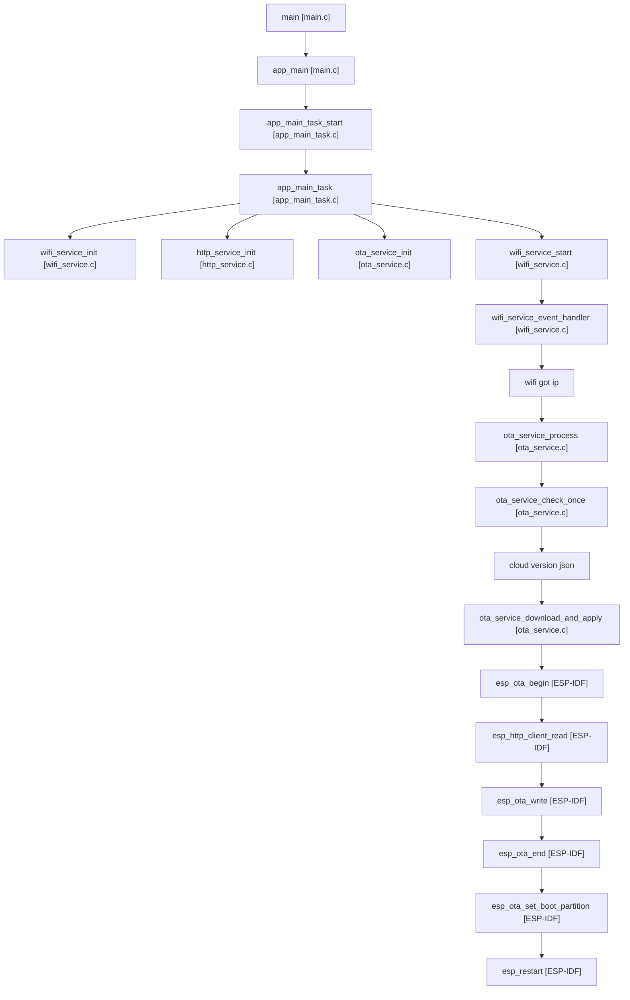
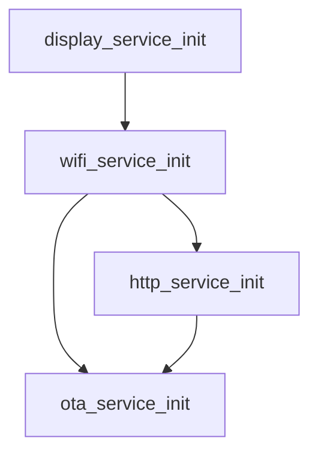
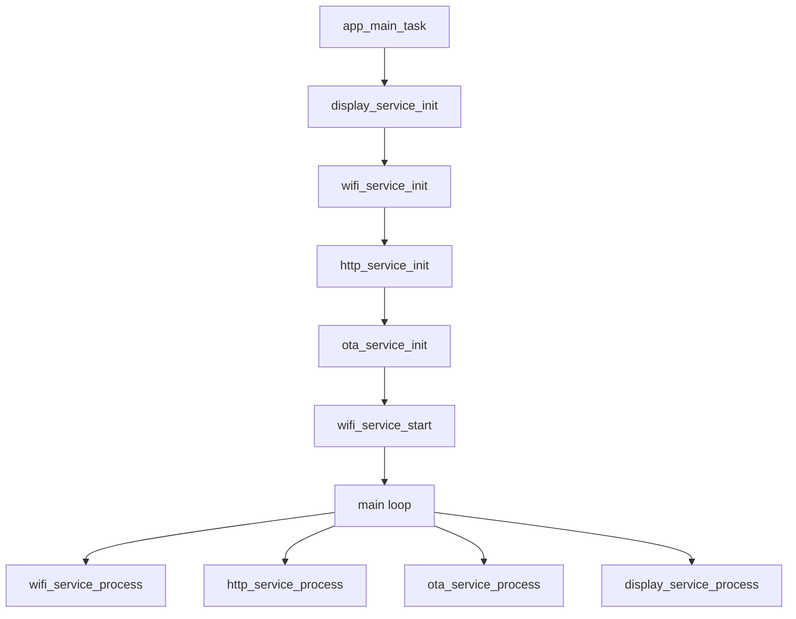
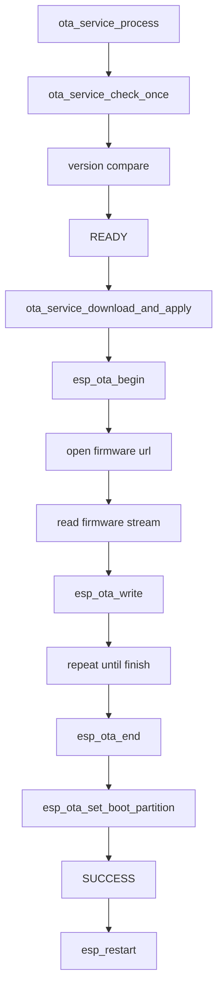
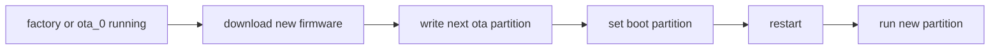
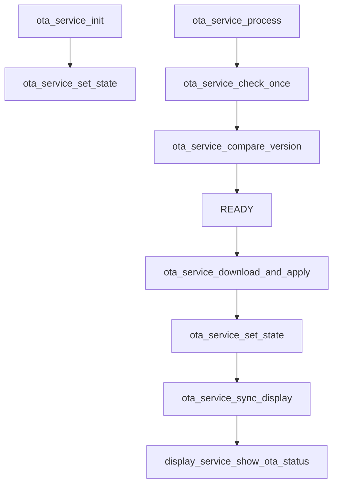
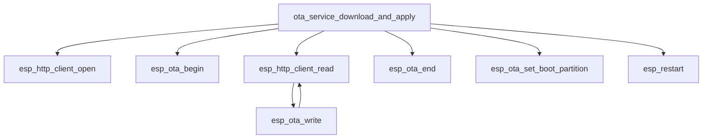
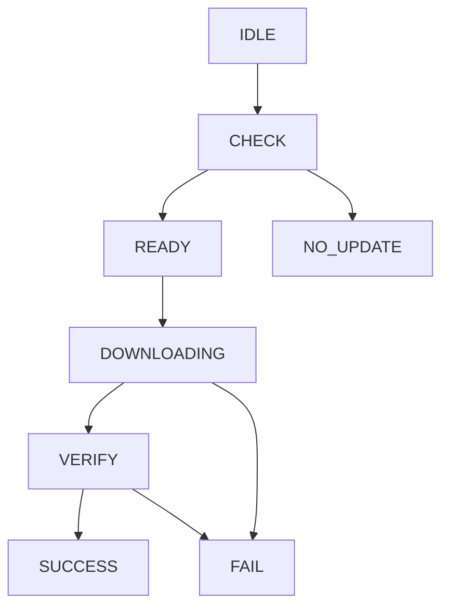
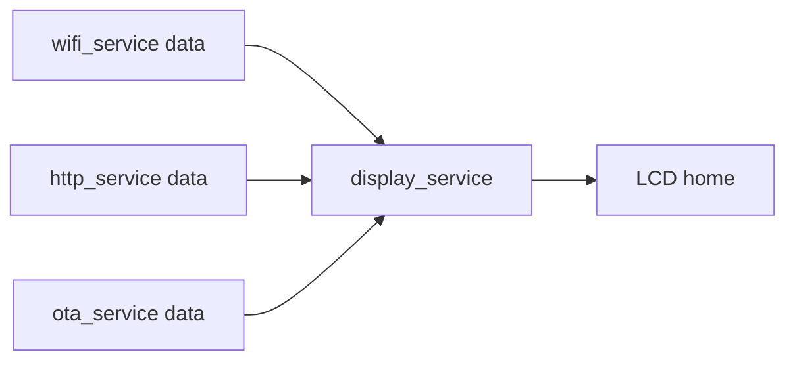
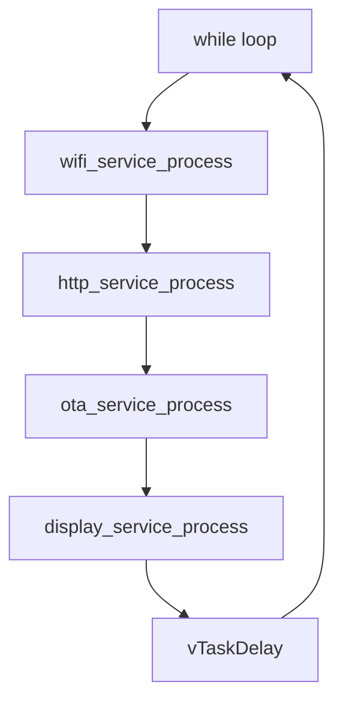

# v1.9.0 项目的事件和函数关系流程表

## 1. 文档定位

这份文档用于说明 `v1.9.0` 的主链关系、初始化依赖、关键事件流和函数调用关系。

本版核心主题是：

```text
真实 OTA 下载与升级
```

也就是把 OTA 从“只检查版本”推进到：

```text
发现新版本
-> 下载固件
-> 写入 OTA 分区
-> 设置启动分区
-> 重启切换新版本
```

---

## 2. 本版总体主链



说明：

- `cloud version json` 表示云端接口返回的版本和固件地址信息
- `ota_service_download_and_apply` 表示本版新增的真实 OTA 下载与写入主链

---

## 3. 初始化依赖关系图



说明：

- `display_service` 先准备好，这样升级过程中的状态能立刻显示
- `http_service` 依赖 `wifi_service`
- `ota_service` 依赖 `wifi_service` 和 `http_service`

---

## 4. 总体初始化流程图



---

## 5. 真实 OTA 下载主流程图



说明：

- `open firmware url` 表示打开云端固件下载地址
- `read firmware stream` 表示循环读取固件数据流
- `repeat until finish` 表示边读边写直到整个固件完成

---

## 6. 分区与升级关系图



说明：

- 真实 OTA 不能把新固件直接写回当前正在运行的分区
- 必须写入“另一个 OTA 分区”
- 所以本版必须先处理好 partition table

---

## 7. ota_service 关键函数关系图



---

## 8. OTA 下载链关键函数关系图



说明：

- `esp_http_client_read` 和 `esp_ota_write` 会形成“边读边写”的循环
- 这条链是本版最关键的新学习点

---

## 9. OTA 状态流图



说明：

- `DOWNLOADING` 表示正在下载并写入 OTA 分区
- `VERIFY` 表示完成写入后的基本校验与收尾
- `SUCCESS` 表示已经准备好切换启动分区

---

## 10. LCD 联动图



说明：

- `ota_service data` 在本版会更重要，因为要显示：
  - `CHECK`
  - `READY`
  - `DOWNLOADING`
  - `VERIFY`
  - `SUCCESS`
  - `FAIL`

建议本版 LCD 重点关注：

- `OTA : DOWNLOADING`
- `OTA : SUCCESS`
- `MSG : downloading`
- `MSG : reboot to new app`

---

## 11. 主循环推进图



说明：

- `wifi_service` 主要还是事件驱动
- `http_service` 提供版本检查和固件下载基础能力
- `ota_service` 在本版成为最核心的流程控制层

---

## 12. 当前版本最值得注意的实现点

### 12.1 本版开始真正碰 OTA 分区

这版和前面最大的区别是：

```text
开始真实写 OTA 分区
```

所以分区表空间问题不再是建议项，而是必须处理。

### 12.2 本版关键学习点是“边下载边写”

也就是：

```text
esp_http_client_read
-> esp_ota_write
```

这条链会成为理解真实 OTA 的核心。

### 12.3 本版仍然不追求复杂升级策略

当前版本重点只放在：

```text
成功升级一次
```

不追求：

- 断点续传
- 复杂回滚策略
- 云端完整升级后台

---

## 13. 推荐阅读顺序

如果后面要边看图边读代码，建议顺序：

1. 总体主链图
2. 真实 OTA 下载主流程图
3. 分区与升级关系图
4. OTA 下载链关键函数关系图
5. OTA 状态流图
6. LCD 联动图

---

## 14. 一句话记住

把 `v1.9.0` 的核心流程记成一句话就够了：

```text
设备从云端拿到新版本后，
把固件下载到另一个 OTA 分区，
再切换启动分区并重启进入新版本。
```
