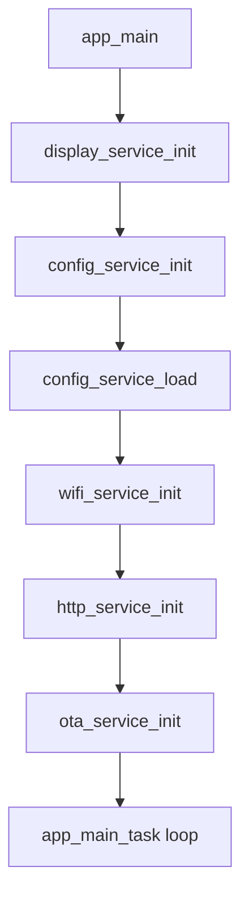
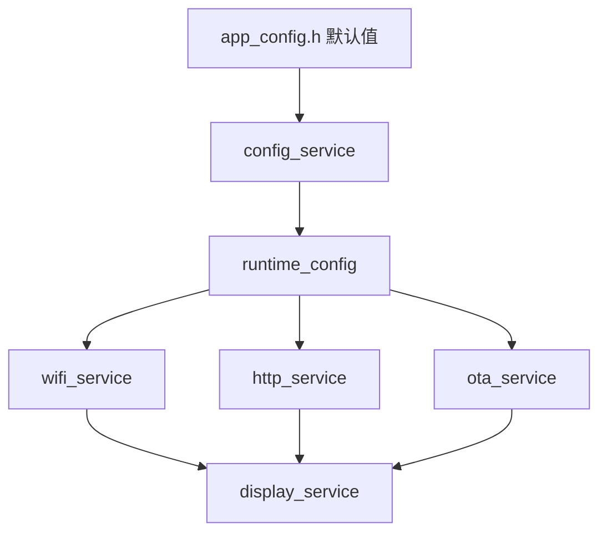
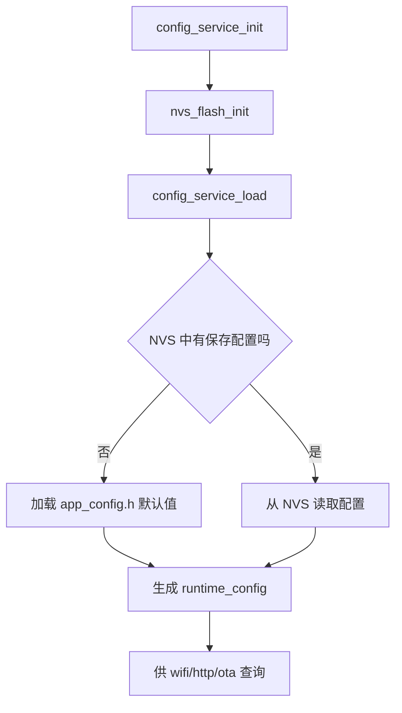
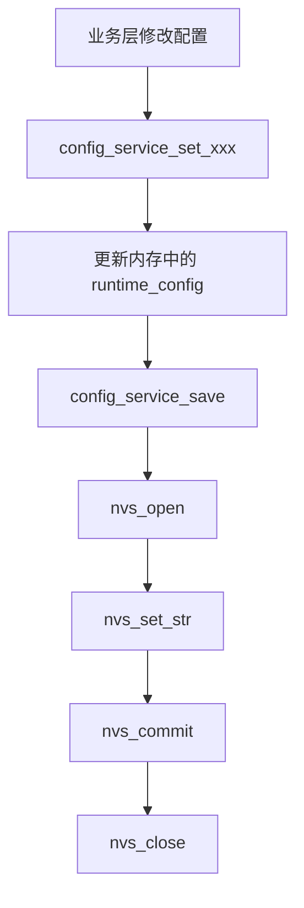
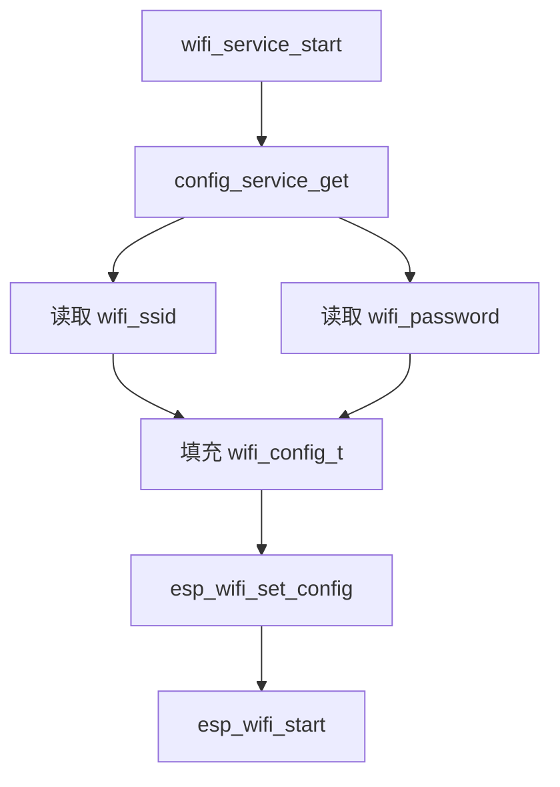
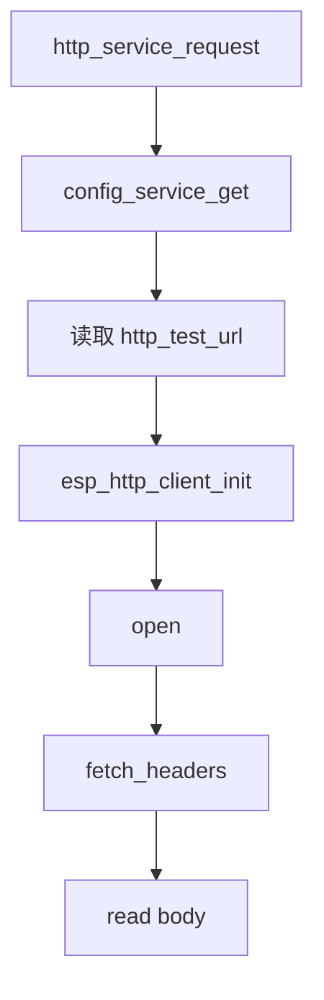
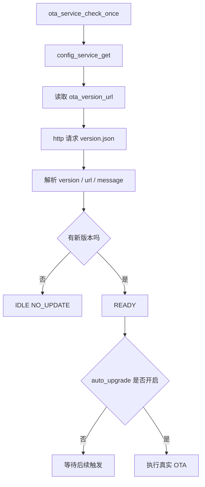
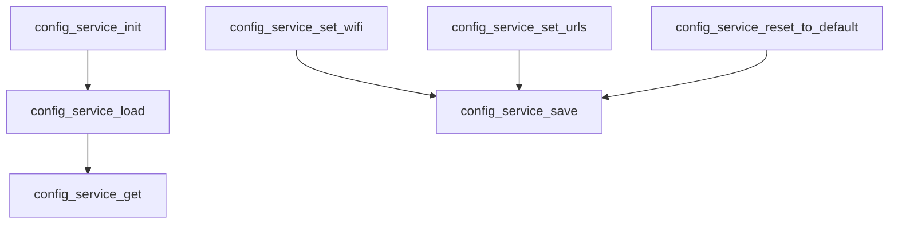
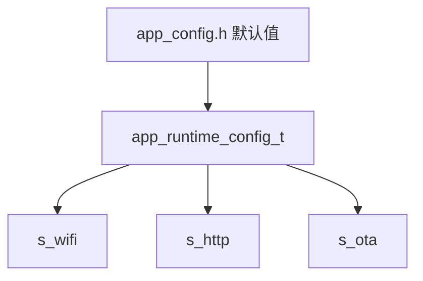

# v2.0.0 项目的事件和函数关系流程表

## 1. 文档定位

这份文档专门把 `v2.0.0` 的主线拆成：

- 初始化顺序
- 配置加载关系
- 配置服务与联网服务的依赖关系
- 后续配置写入与保存流程

这一版的核心不是新增联网协议，而是把现有联网能力挂到：

```text
config_service
```

这一层上。

---

## 2. v2.0.0 总体主链



这条链的重点是：

```text
先把配置读出来
再初始化联网服务
```

---

## 3. 初始化依赖关系



这里最关键的变化是：

- `app_config.h`
  - 不再只是最终使用值
  - 更像默认值来源

- `config_service`
  - 成为所有联网相关配置的统一入口

---

## 4. 配置加载流程



---

## 5. 配置保存流程



这条链后面可以来自很多入口：

- 按键菜单
- 串口命令
- 调试函数
- Web 配网
- 云端配置接口

但当前 `v2.0.0` 先不强求入口形式，先把保存链做好。

---

## 6. Wi-Fi 配置使用流程



这一版的关键变化是：

- 不再直接使用 `APP_WIFI_STA_SSID`
- 不再直接使用 `APP_WIFI_STA_PASSWORD`

而是统一从：

- `runtime_config`

读取。

---

## 7. HTTP 配置使用流程



---

## 8. OTA 配置使用流程



---

## 9. 配置服务建议接口关系



---

## 10. 推荐运行时结构关系



这里的意思是：

- `wifi_service`
- `http_service`
- `ota_service`

都不再自己维护一份独立配置源，而是共享：

- `app_runtime_config_t`

---

## 11. LCD 联动建议

这版不建议一开始就在 LCD 上显示太多配置细节。  
先保留最有价值的几个：

- 当前 Wi‑Fi SSID
- 当前 OTA 版本接口是否有效
- 必要时显示“默认配置”或“已保存配置”

推荐思路：

```text
CFG : DEFAULT
SSID: LV-HOME
OTA : URL OK
```

---

## 12. 一句话记住

`v2.0.0` 的流程核心就是：

```text
先用 config_service 把配置统一起来，
再让 Wi‑Fi、HTTP、OTA 都从这份运行时配置读取参数。
```
