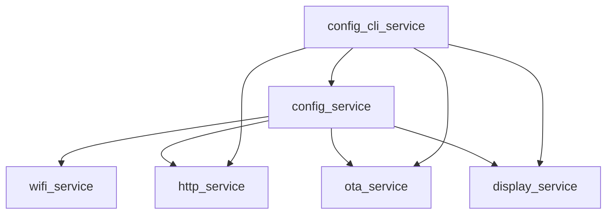
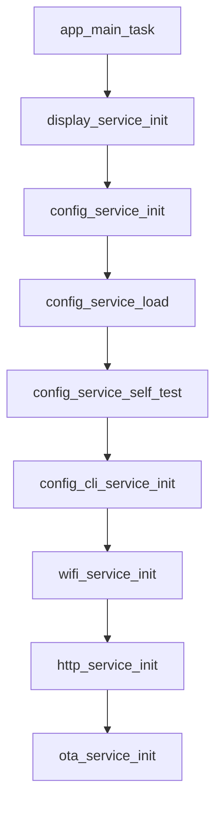
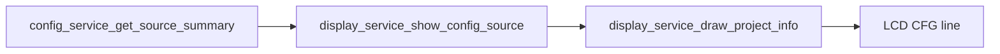
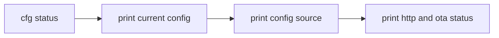
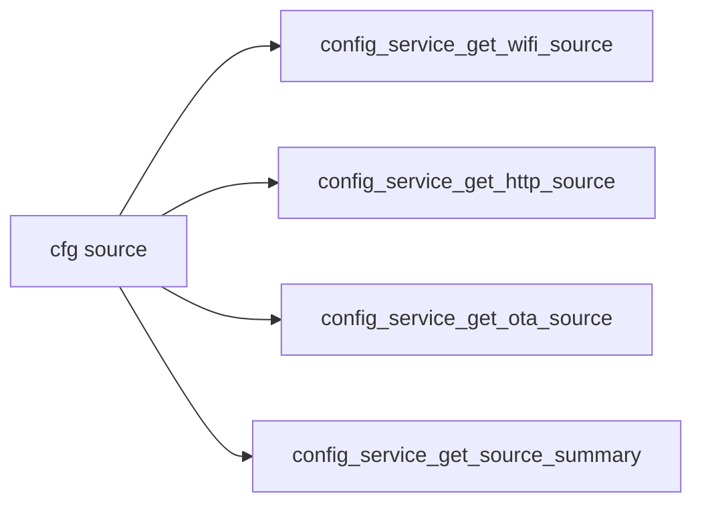
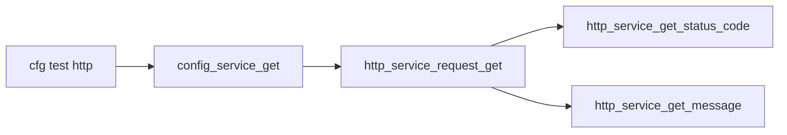
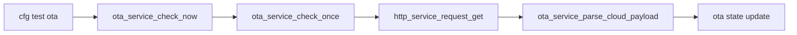

# v2.1.0 项目的事件和函数关系流程表

## 总体主链

## 初始化顺序

## 配置来源显示链

## 串口命令执行链

## cfg status

## cfg source

## cfg test http

## cfg test ota

## 关键函数关系

### 配置层

- `config_service_init()`
- `config_service_load()`
- `config_service_save()`
- `config_service_reset_to_default()`
- `config_service_get_source_summary()`

### 显示层

- `display_service_show_config_source()`
- `display_service_draw_project_info()`

### CLI 层

- `config_cli_service_init()`
- `config_cli_service_process()`
- `config_cli_service_execute_line()`
- `config_cli_service_log_status()`
- `config_cli_service_log_config_source()`

### OTA 层

- `ota_service_process()`
- `ota_service_check_now()`
- `ota_service_check_once()`
