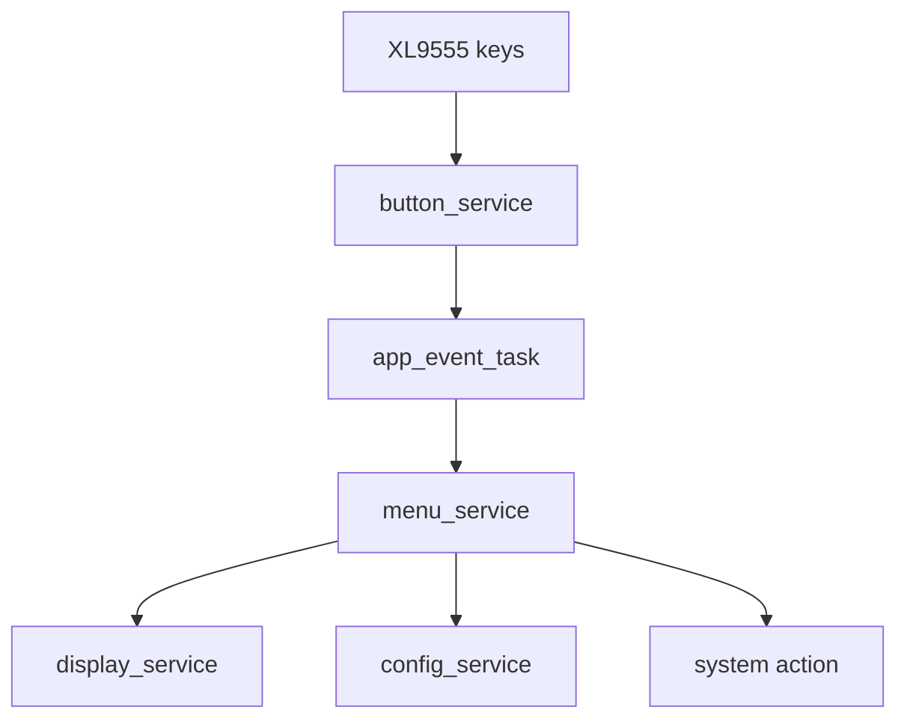
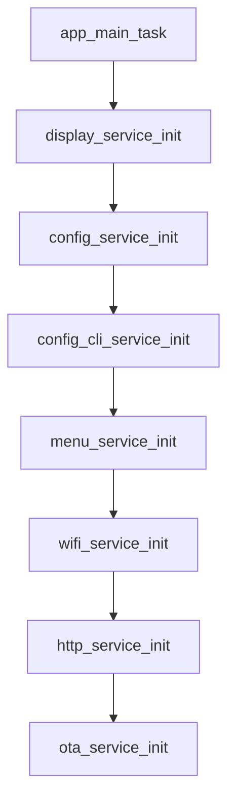
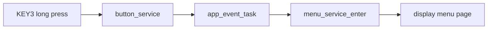
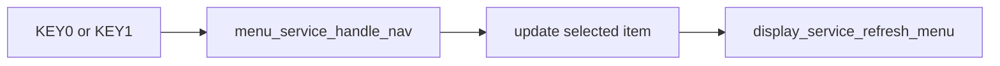
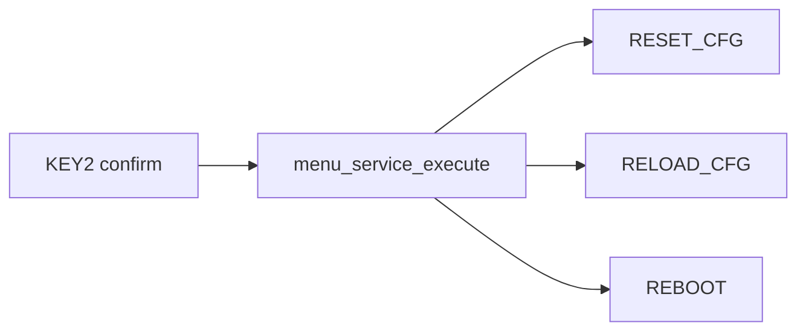

# v2.2.0 项目的事件和函数关系流程表

## 总体主链

```mermaid
flowchart TD
    A[XL9555 keys] --> B[button_service]
    B --> C[app_event_task]
    C --> D[menu_service]
    D --> E[display_service]
    D --> F[config_service]
    D --> G[system action]
```

## 初始化顺序

```mermaid
flowchart TD
    A[app_main_task] --> B[display_service_init]
    B --> C[config_service_init]
    C --> D[config_cli_service_init]
    D --> E[menu_service_init]
    E --> F[wifi_service_init]
    F --> G[http_service_init]
    G --> H[ota_service_init]
```

## 菜单进入链

```mermaid
flowchart LR
    A[KEY3 long press] --> B[button_service]
    B --> C[app_event_task]
    C --> D[menu_service_enter]
    D --> E[display menu page]
```

## 菜单导航链

```mermaid
flowchart LR
    A[KEY0 or KEY1] --> B[menu_service_handle_nav]
    B --> C[update selected item]
    C --> D[display_service_refresh_menu]
```

## 菜单动作链

```mermaid
flowchart LR
    A[KEY2 confirm] --> B[menu_service_execute]
    B --> C[RESET_CFG]
    B --> D[RELOAD_CFG]
    B --> E[REBOOT]
```

## 返回退出链

```mermaid
flowchart LR
    A[KEY3 short press] --> B[menu_service_back]
    B --> C[previous page]
    C --> D[or hidden]
```
